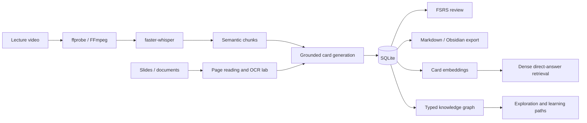

<h1 align="center">Video Course Cards</h1>

<p align="center">
  <strong>A local-first learning system and research testbed for turning technical lectures into timestamp-grounded knowledge.</strong>
</p>

<p align="center">
  Video, audio, slides, and documents become structured cards whose claims remain linked to source evidence, course context, and review history.
</p>

<p align="center">
  <a href="https://github.com/eatoften/Video_Course_Cards/releases/latest"><strong>Download for Windows</strong></a>
  &nbsp;|&nbsp;
  <a href="docs/Multimodal%20CNN%20ViT%20reader%20study.md">Multimodal study</a>
  &nbsp;|&nbsp;
  <a href="docs/RAG%20retrieval%20and%20graph%20study.md">RAG study</a>
  &nbsp;|&nbsp;
  <a href="docs/Graph%20as%20associative%20knowledge%20structure.md">Graph hypothesis</a>
  &nbsp;|&nbsp;
  <a href="docs/roadmap.md">Roadmap</a>
</p>

<p align="center">
  <a href="https://github.com/eatoften/Video_Course_Cards/releases/latest"></a>
  
  
  
  
  
</p>

## Overview

Video Course Cards is both a working Windows desktop application and a controlled experimental pipeline. It is not designed as another generic "chat with a transcript" wrapper. Its central representation is a **claim-grounded knowledge card**:

```json
{
  "title": "Singular Value Decomposition",
  "claims": [
    {
      "text": "SVD factors a matrix using orthogonal and diagonal structure.",
      "evidence": [
        {
          "quote": "called the singular value decomposition",
          "start_seconds": 724.0,
          "end_seconds": 738.0
        }
      ]
    }
  ]
}
```

These cards give the product and research code a common unit for generation, evidence auditing, retrieval, review, graph organization, and Markdown export. SQLite remains the source of truth; exported Markdown is a portable snapshot.

### Project status

| Track | Current state | Evidence status |
| --- | --- | --- |
| Desktop learning workspace | Installable Windows demo, release `v0.1.1` | Product prototype |
| CNN vs ViT slide-line OCR | One frozen lecture-level test evaluation | Confirmatory under the recorded protocol |
| OCR-to-card error cascade | Same local Qwen and card evaluator for all readers | Exploratory after an infrastructure revision |
| Card retrieval and grounded RAG | Five retrieval systems, fixed-budget Qwen comparison | Exploratory development split; human review pending |
| Associative knowledge graph | Structural audit and falsifiable scale hypotheses | Candidate graph; not a large-scale result |

## System



The retrieval design now separates two roles:

```text
direct question -> Dense retrieval -> evidence gate -> grounded answer
explore / review -> Dense anchor -> typed Graph -> concept trail
```

Graph traversal is a knowledge-organization hypothesis, not an unconditional replacement for Dense retrieval.

## Research Questions

The repository currently investigates three connected problems:

1. **Multimodal evidence:** how do slide-reading errors propagate into generated learning artifacts?
2. **Grounded retrieval:** which simple RAG baseline best retrieves card, claim, and timestamp evidence under a fixed budget?
3. **Associative structure:** when does a typed graph add useful nonlocal organization beyond embedding similarity?

The research code is isolated from product services:

```text
backend/app              product APIs, SQLite workflows, local application
backend/multimodal_lab   datasets, CNN/ViT models, trainers, sealed protocols
backend/rag_lab          frozen corpora, retrieval baselines, metrics, audits
```

## Results

### 1. Controlled slide-line recognition

The frozen dataset contains 1,402 line crops from five independent CS231n lectures. Lectures 1-3 are training data, Lecture 4 is validation-only, and Lecture 5 was opened once for sealed evaluation. CNN and ViT share the same crops, vocabulary, augmentation, CTC head, decoder, trainer, checkpoint rule, and approximately matched parameter budget.

| Reader | Parameters | CER down | WER down | Exact lines up | Median CPU ms/line down |
| --- | ---: | ---: | ---: | ---: | ---: |
| CNN-CTC v2 | 120,629 | **0.1150** | **0.3155** | **73 / 176** | 4.414 |
| ViT-CTC v1 | 111,253 | 0.4461 | 0.9442 | 5 / 176 | **0.687** |
| RapidOCR stored text | not measured | **0.0071** | **0.0408** | **158 / 176** | not measured |

CNN minus ViT CER is `-0.3311`, with a paired 95% bootstrap interval of `[-0.4126, -0.2551]`; all 5,000 resamples favor CNN. Both models first passed the same 32-line exact-overfit gate, so the difference concerns small-data generalization rather than basic trainability.

RapidOCR is a practical recognition reference, not a complete page-reading comparison. Its stored text uses already accepted detector polygons, so detector recall and latency are outside this table.

### 2. OCR-to-card error propagation

Predicted lines were reconstructed into the same 16 slide pages and passed to frozen `qwen3:4b` generation at temperature zero. Gold concepts were not included in prompts.

| OCR source | Concept recall up | Grounded claim precision up | Citation correctness up | Usable-card conversion up |
| --- | ---: | ---: | ---: | ---: |
| CNN-CTC v2 | **0.7500** | 0.8667 | 0.6250 | 0.3750 |
| ViT-CTC v1 | 0.4375 | 0.4375 | 0.0000 | 0.0000 |
| RapidOCR stored text | **0.7500** | **0.9167** | **0.9231** | **0.6875** |

Three findings matter:

- OCR quality propagates into concept recovery and usable cards.
- Successful JSON generation is not evidence of content quality.
- Character accuracy is insufficient when page layout or diagram direction carries meaning.

The reader comparison is confirmatory; this downstream cascade is explicitly exploratory. See the [full multimodal methods, hashes, error slices, and validity threats](docs/Multimodal%20CNN%20ViT%20reader%20study.md) and the [compact protocol artifact](docs/experiments/assignment_5_protocol_results.json).

### 3. Card retrieval and grounded generation

The RAG development study freezes 118 cards, 140 claims, 150 evidence spans, and a balanced 100-question candidate benchmark. Forty development questions are used below; the 60-question candidate test split is blocked until independent review.

| Retrieval system | Recall@5 up | MRR up | nDCG@5 up | Multi-hop joint R@3 up |
| --- | ---: | ---: | ---: | ---: |
| BM25 | 0.859 | 0.737 | 0.746 | 0.375 |
| Dense MiniLM | **1.000** | **0.901** | **0.924** | 0.750 |
| BM25 + Dense RRF | 0.969 | 0.891 | 0.898 | 0.500 |
| Dense + noisy graph | **1.000** | 0.875 | 0.904 | 0.750 |
| Dense + candidate graph | **1.000** | 0.805 | 0.852 | **0.875** |

Candidate graph expansion raises multi-hop joint Recall@3 by `0.125`, but lowers single-card nDCG@5 by `0.163`. Under the same top-5 context, prompt, Qwen digest, and character budget, graph expansion produces one gold-claim citation-recall win, 39 ties, and no multi-hop answer gain.

Prompt-only abstention failed on all eight unsupported development questions. A frozen pre-generation Dense-confidence gate produced eight correct refusals and one shared false abstention, for `0.984` abstention F1. This threshold was selected and evaluated on development data and is not a test result.

See the [RAG study](docs/RAG%20retrieval%20and%20graph%20study.md), [protocols and compact results](docs/experiments/), and [reproduction commands](backend/rag_lab/README.md).

### 4. Graph as knowledge structure

The same candidate graph was audited separately from QA reranking:

| Structural measurement | Result |
| --- | ---: |
| Cards covered by an accepted candidate edge | 32 / 118, 27.1% |
| Isolated cards | 86 |
| Largest connected component | 4 cards |
| Candidate-edge mean cosine | 0.515 |
| Lecture-matched random non-edge mean | 0.267 |
| Edges with at least one endpoint outside Dense top-5 | 9 / 20, 45.0% |

The graph is too sparse to support a large-scale associative-memory claim. However, some typed relations encode learning structure outside the nearest semantic neighborhood. This motivates a falsifiable dual-system hypothesis: use Dense for direct questions and evaluate typed, query-conditioned Graph activation for exploration, global organization, prerequisite sequencing, and personalized review.

The analysis, null baseline, failure conditions, and scaling protocol are in [Graph as an Associative Knowledge Structure](docs/Graph%20as%20associative%20knowledge%20structure.md). Machine-readable results are in [rag_graph_organization_audit_v1.json](docs/experiments/rag_graph_organization_audit_v1.json).

## Product Capabilities

The desktop application currently supports:

- media validation with `ffprobe`, audio extraction with FFmpeg, and timestamped faster-whisper transcription;
- embedding-based semantic transcript chunking and manual or automatic card generation with local Qwen;
- SQLite persistence for courses, jobs, transcripts, cards, claims, evidence, notes, relations, and review state;
- a nested Course Map, typed card relations, graph exploration, and related-card suggestions;
- independently scheduled FSRS recall prompts linked to grounded claims;
- local PPTX, PDF, DOCX, Markdown, and text imports for concept study documents;
- dense card retrieval in the application and controlled grounded-answer generation in the isolated RAG lab;
- versioned study documents and Obsidian-friendly Markdown folder export;
- a React/TypeScript interface packaged by Tauri with a FastAPI sidecar.

All course data stays on the local machine by default. Ollama and Sentence Transformer models are local dependencies rather than hosted APIs.

## Install

Download the Windows installer from the [latest GitHub release](https://github.com/eatoften/Video_Course_Cards/releases/latest).

The installer contains the Tauri shell, React interface, packaged FastAPI backend, and SQLite application. Large third-party runtimes and model weights are not bundled. Install the local generation model separately:

```powershell
ollama pull qwen3:4b
```

FFmpeg, Ollama/Qwen, and the configured Sentence Transformer must be available for their corresponding features. The application exposes a local runtime status check. See [Local LLM setup](docs/local-llm.md) and [desktop packaging](docs/tauri-desktop.md).

Desktop data is stored under:

```text
C:\Users\<user>\AppData\Local\Video Course Cards\
```

Current release constraints:

- Windows is the only packaged target exercised;
- the installer is not code-signed;
- model installation remains user-managed;
- Markdown export is one-way and does not synchronize edits into SQLite.

## Developer Quickstart

Requirements: Python 3.11, [uv](https://docs.astral.sh/uv/), Node.js 22, FFmpeg, and Ollama. Rust, MSVC, the Windows SDK, and WebView2 are needed only for desktop builds.

```powershell
git clone https://github.com/eatoften/Video_Course_Cards.git
cd Video_Course_Cards
```

Start FastAPI:

```powershell
cd backend
$env:PYTHONUTF8='1'
$env:PYTHONDONTWRITEBYTECODE='1'
uv sync
uv run python -B -m uvicorn app.main:app --host 127.0.0.1 --port 8001 --reload
```

Start React in a second terminal:

```powershell
cd frontend
npm.cmd install
npm.cmd run dev
```

Open `http://127.0.0.1:5174`. FastAPI documentation is at `http://127.0.0.1:8001/docs`.

Run the Tauri desktop shell:

```powershell
powershell -NoProfile -ExecutionPolicy Bypass -File .\scripts\build-desktop-backend.ps1
cd frontend
npm.cmd run tauri:dev
```

## Reproducing The Research

Run backend regression tests first:

```powershell
cd backend
uv run pytest
```

Current verification: `302 passed`; the remaining warning comes from the installed Starlette/httpx TestClient compatibility layer.

Research entry points:

| Study | Code | Methods and results |
| --- | --- | --- |
| Multimodal page transition and reading | `backend/multimodal_lab` | [Multimodal study](docs/Multimodal%20CNN%20ViT%20reader%20study.md) |
| RAG retrieval and grounded generation | `backend/rag_lab` | [RAG lab reproduction](backend/rag_lab/README.md) |
| Associative graph audit | `backend/rag_lab/run_graph_organization_audit.py` | [Graph hypothesis](docs/Graph%20as%20associative%20knowledge%20structure.md) |

The experiment lifecycle is:

```text
versioned protocol
-> dataset and leakage audit
-> train/development decisions
-> frozen evaluation
-> compact result with hashes and limitations
```

Generated videos, frames, line crops, transcripts, embeddings, checkpoints, and full prediction logs remain in ignored `backend/data/` directories. Git tracks code, protocol versions, source-review decisions, compact metrics, run IDs, hashes, and validity notes. Because lecture media cannot be redistributed, a fresh clone can inspect provenance and run tests but cannot reproduce exact numerical OCR results without recreating source data matching the recorded hashes.

The Lecture 5 OCR test has already been opened once and must not be used for further tuning. The RAG candidate test runner remains blocked until every benchmark item, gold claim, evidence span, and graph decision receives independent human review.

## Repository Layout

```text
Video_Course_Cards/
|-- backend/
|   |-- app/                    # FastAPI product and SQLite services
|   |-- multimodal_lab/         # datasets, CNN/ViT, training, protocols
|   |-- rag_lab/                # corpora, retrievers, metrics, graph audits
|   |-- tests/                  # product and research regression tests
|   `-- data/                   # ignored user data and experiment runs
|-- frontend/
|   |-- src/                    # React/TypeScript learning workspace
|   `-- src-tauri/              # Rust shell and sidecar lifecycle
|-- docs/
|   |-- experiments/            # compact machine-readable results
|   `-- *.md                    # reports, roadmaps, engineering notes
|-- scripts/                    # desktop build and smoke-test scripts
`-- .github/workflows/          # tagged Windows release build
```

Important entry points:

| Area | Entry point |
| --- | --- |
| FastAPI application | `backend/app/main.py` |
| Video processing | `backend/app/video_pipeline.py` |
| Semantic chunking | `backend/app/transcript_chunker.py` |
| Grounded card generation | `backend/app/card_service.py` |
| Dense product retrieval | `backend/app/rag_service.py` |
| CNN-CTC / ViT-CTC | `backend/multimodal_lab/models/` |
| Shared reader trainer | `backend/multimodal_lab/training/reader_trainer.py` |
| Retrieval baselines | `backend/rag_lab/retrievers.py` |
| RAG evaluation | `backend/rag_lab/metrics.py` |
| Graph organization audit | `backend/rag_lab/graph_organization.py` |

## Research Hygiene

- Data splits are made at lecture level, not random line level.
- CNN and ViT share data, tokenizer, output contract, trainer, evaluator, and checkpoint-selection policy.
- Validation selects models; sealed test data evaluates frozen decisions.
- RAG systems share the same corpus, embedding model, top-k, prompt, context budget, and local Qwen digest.
- Protocols and reports record semantic hashes and input file hashes.
- Resume and answer reuse are rejected when generation settings change.
- Failed runs and protocol revisions remain documented.
- Automatic semantic proxies are not reported as human correctness.

## Limitations

- The multimodal study covers five lectures from one course and one slide family.
- OCR source labels still need an independent spot-check before publication-level claims.
- RapidOCR results exclude detector recall and page-level detector latency.
- The downstream card cascade contains only 16 pages and one model-assisted source auditor.
- The RAG benchmark and 20 graph edges remain model-assisted candidates awaiting independent review.
- Only eight development questions exercise multi-hop retrieval.
- The graph covers 27.1% of cards and cannot establish large-scale associative behavior.
- The current local 4B model and development-calibrated refusal gate are baselines, not final answer-quality claims.

## Next Experiments

1. Complete independent RAG question, claim, evidence, and graph review; freeze thresholds and open the test split once.
2. Grow the card corpus through incremental course snapshots and test a `task type x corpus scale` graph crossover.
3. Compare always-Dense, unconditional graph expansion, typed traversal, query-conditioned PPR, and a task router under equal budgets.
4. Add a newly held-out multimodal lecture with aligned audio, layout-aware reading, and a second independent card auditor.
5. Evaluate graph-supported learning paths with prerequisite violations, discovery utility, delayed recall, and time-to-mastery.

## Documentation

| Document | Scope |
| --- | --- |
| [Multimodal CNN/ViT Reader Study](docs/Multimodal%20CNN%20ViT%20reader%20study.md) | OCR protocol, results, cascade, error analysis |
| [Card Retrieval and Graph RAG Study](docs/RAG%20retrieval%20and%20graph%20study.md) | Benchmark, baselines, grounded generation, R4 comparison |
| [Graph as an Associative Knowledge Structure](docs/Graph%20as%20associative%20knowledge%20structure.md) | Structural audit, hypotheses, falsification and scaling |
| [RAG Research Roadmap](docs/rag-roadmap.md) | Formal test gate and later retrieval studies |
| [Desktop Packaging](docs/tauri-desktop.md) | Sidecar, data paths, installer, release workflow |
| [Project Roadmap](docs/roadmap.md) | Product and research milestones |

## Principles

- Local data stays local by default.
- Generated claims remain traceable to evidence.
- Simple baselines precede complex agents.
- Validation selects; test data evaluates frozen decisions.
- User corrections become evaluation data before training data.
- Negative results and limitations are part of the artifact.

## License

No open-source license has been declared yet. Source availability does not grant permission to redistribute or reuse the code. A license must be selected before a formal public research release.
