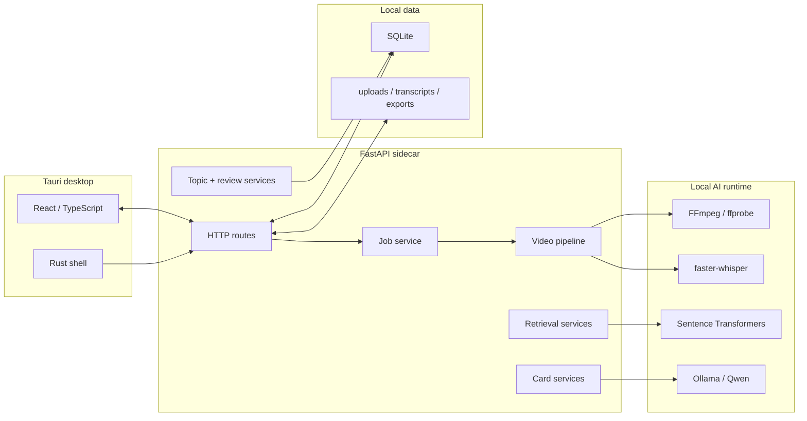

<h1 align="center">Video Course Cards</h1>

<p align="center">
  Turn long course videos into timestamp-grounded knowledge cards, local card memory, and Obsidian-friendly Markdown.
</p>

<p align="center">
  <a href="https://github.com/eatoften/Video_Course_Cards/releases/latest">Download</a>
  |
  <a href="docs/tauri-desktop.md">Desktop build</a>
  |
  <a href="docs/local-llm.md">Local LLM setup</a>
  |
  <a href="docs/roadmap.md">Roadmap</a>
  |
  <a href="docs/rag-roadmap.md">RAG plan</a>
</p>

<p align="center">
  
  
  
  
  
</p>

## Overview

Video Course Cards is a local-first AI learning workspace for lecture videos. It turns a video into a transcript, cuts the transcript into semantic chunks, drafts grounded knowledge cards with a local LLM, organizes them into a course map, schedules evidence-backed recall with FSRS, and exports portable Markdown snapshots.

The project is not trying to be another generic "chat with your transcript" demo. The core object is a **claim-grounded knowledge card**: a structured learning unit whose claims point back to transcript evidence and timestamps. And the future plan is to turn these cards in to a graph which can serve as an external world model that a controller can plan over, while a decoder can take the plan and graph as an input to generate answers.

```text
video -> transcript -> semantic chunks -> grounded cards -> course map / review / graph -> Markdown export
```

SQLite is the source of truth. Markdown is an export format.

## Why This Exists

Long technical lectures contain more than raw transcript text. A useful learning system should preserve where an idea came from, what evidence supports it, how it connects to other cards, and how the user later edits or rejects it.

This repository explores that pipeline as a local desktop application:

- **Grounded generation**: cards keep claims, evidence, and source timestamps.
- **Local-first storage**: videos, transcripts, cards, embeddings, and notes stay on the user's machine.
- **Structured memory**: cards are JSON/SQLite records before they become Markdown.
- **Learning structure**: a topic tree expresses curriculum order while card relations preserve lateral connections.
- **Active recall**: independent review items are scheduled locally with FSRS and retain links to grounded claims.
- **Concept study**: cards can grow into versioned Markdown documents grounded in course claims and local source files.
- **Retrieval baseline**: card embeddings support ordinary dense retrieval before more advanced graph-guided methods.
- **Portable output**: exports are Obsidian-friendly Markdown snapshots.

## Current Demo

The current demo runs on Windows as a Tauri desktop app with a packaged FastAPI sidecar.

It can:

- upload local videos;
- validate media with ffprobe;
- extract audio with FFmpeg;
- transcribe with faster-whisper;
- show transcript segments next to the course workspace;
- create semantic transcript chunks with Sentence Transformer embeddings;
- generate cards manually from selected transcript text or automatically from chunks;
- save, edit, delete, tag, and classify card content;
- attach user notes to cards;
- organize cards in a nested Course Map, manually or from embedding-based suggestions;
- create multiple review prompts per card and schedule them independently with FSRS;
- review by course or topic with expected answers and transcript evidence;
- import PPTX, PDF, DOCX, TXT, or Markdown as locally stored source units;
- create, edit, generate, cite, version, and restore concept Study documents;
- inspect Course Map review/Study coverage and correct Topics by merge or split;
- embed cards and run dense card retrieval;
- compute and persist related-card edges with cosine similarity;
- explore cards in an interactive course graph;
- accept, reject, hide, edit, or manually add card relations;
- use local Qwen to classify candidate relations;
- export one job or all cards as Markdown folders;
- check local runtime dependencies such as FFmpeg, Ollama/Qwen, and embedding models.

Still rough:

- the installer is not code-signed;
- Windows is the only packaged target currently exercised;
- Ollama, Qwen, FFmpeg, and model caches are user-installed dependencies;
- RAG currently retrieves cards, but answer generation with citations is still planned;
- exported Markdown does not sync edits back into SQLite.

## Install

Download the latest Windows installer from:

```text
https://github.com/eatoften/Video_Course_Cards/releases/latest
```

The installer includes:

- Tauri desktop shell;
- React UI;
- packaged FastAPI backend;
- SQLite schema and app code.

The installer does **not** bundle large model assets. Install local AI dependencies separately:

```powershell
ollama pull qwen3:4b
```

Desktop data is stored under:

```text
C:\Users\<user>\AppData\Local\Video Course Cards\
```

See [docs/local-llm.md](docs/local-llm.md) for local model configuration.

## Developer Setup

Clone the repository, then install backend and frontend dependencies.

```powershell
git clone https://github.com/eatoften/Video_Course_Cards.git
cd Video_Course_Cards
```

Run the backend:

```powershell
cd backend
$env:PYTHONUTF8='1'
$env:PYTHONDONTWRITEBYTECODE='1'
uv run python -B -m uvicorn app.main:app --host 127.0.0.1 --port 8001 --reload
```

Run the frontend:

```powershell
cd frontend
npm.cmd install
npm.cmd run dev
```

Open:

```text
http://127.0.0.1:5174
```

## Desktop Build

Tauri requires Rust/Cargo and the Visual Studio C++ build tools on Windows.

Build the backend sidecar:

```powershell
powershell -NoProfile -ExecutionPolicy Bypass -File .\scripts\build-desktop-backend.ps1
```

Run the desktop app in development:

```powershell
cd frontend
npm.cmd run tauri:dev
```

Build the Windows installer:

```powershell
powershell -NoProfile -ExecutionPolicy Bypass -File .\scripts\build-windows-installer.ps1
```

Output:

```text
frontend\src-tauri\target\release\bundle\nsis\Video Course Cards_0.1.0_x64-setup.exe
```

GitHub Actions can build and attach the installer to a tag release:

```powershell
git tag v0.1.0
git push origin v0.1.0
```

See [docs/tauri-desktop.md](docs/tauri-desktop.md).

## Architecture



The backend is deliberately split by responsibility:

| Layer | Responsibility |
| --- | --- |
| `main.py` | HTTP routes and response mapping |
| `job_service.py` | video job orchestration |
| `job_store.py` | SQLite CRUD for jobs |
| `video_pipeline.py` | media probe, audio extraction, transcription |
| `transcript_chunker.py` | semantic transcript chunking |
| `knowledge_card_service.py` | card persistence and updates |
| `topic_service.py` | course hierarchy and card membership workflows |
| `review_service.py` | FSRS queue construction and rating workflow |
| `source_asset_service.py` | local document validation, storage, and extraction orchestration |
| `learning_document_service.py` | anchor-card documents, citations, LLM generation, and versions |
| `card_embedding_service.py` | card text -> embedding workflow |
| `rag_service.py` | card retrieval baseline |
| `desktop_server.py` | packaged backend sidecar entrypoint |

## Knowledge Cards

A card is stored as structured data, not just markdown text.

```json
{
  "card_kind": "concept",
  "title": "Singular Value Decomposition",
  "summary": "SVD factors a matrix into orthogonal and diagonal structure.",
  "content_status": "reviewed",
  "tags": ["linear algebra", "matrix factorization"],
  "source_start_seconds": 724.0,
  "source_end_seconds": 738.0,
  "claims": [
    {
      "id": "claim-uuid",
      "text": "SVD decomposes a matrix using orthogonal and diagonal components.",
      "evidence": [
        {
          "id": "evidence-uuid",
          "quote": "called the singular value decomposition",
          "segment_start_seconds": 724.0,
          "segment_end_seconds": 738.0
        }
      ]
    }
  ]
}
```

Recall prompts are separate scheduling units:

```json
{
  "card_id": "card-uuid",
  "item_type": "explain",
  "prompt": "What structure does SVD use to factor a matrix?",
  "expected_answer": "It uses orthogonal matrices and a diagonal matrix.",
  "source_claim_ids": ["claim-uuid"]
}
```

This separation allows one knowledge card to have several independently
scheduled review prompts without mixing memory state into card content.

## API Surface

Selected endpoints:

| Endpoint | Purpose |
| --- | --- |
| `POST /videos` | upload and register a local video |
| `POST /jobs/{job_id}/run` | run probe -> audio -> transcription |
| `GET /jobs/{job_id}/transcript` | return timestamped transcript segments |
| `POST /jobs/{job_id}/chunks` | generate semantic transcript chunks |
| `POST /jobs/{job_id}/cards/auto-generate` | generate cards from chunks |
| `GET /jobs/{job_id}/cards` | list cards for one video job |
| `PATCH /cards/{card_id}` | edit a saved card |
| `POST /cards/{card_id}/embedding` | embed one card |
| `POST /courses/{course_id}/card-embeddings` | embed all cards in a course |
| `POST /courses/{course_id}/card-relations/recompute` | persist top-k cosine similarity relations |
| `GET /courses/{course_id}/card-relations` | return graph nodes and relation edges |
| `POST /courses/{course_id}/card-relations` | create a manual typed relation |
| `POST /card-relations/{relation_id}/classify` | classify a relation with local Qwen |
| `GET /courses/{course_id}/map` | return topics, memberships and topic relations |
| `POST /courses/{course_id}/topics/suggest` | cluster Unsorted cards into reviewable topic suggestions |
| `PUT /cards/{card_id}/primary-topic` | move a card to a primary topic |
| `GET /courses/{course_id}/review/queue` | get due FSRS review items by course or topic |
| `POST /review-items/{review_item_id}/rate` | rate recall and schedule the next review |
| `POST /courses/{course_id}/source-assets` | import and locally extract PPTX/PDF/DOCX/text |
| `POST /cards/{card_id}/learning-documents` | create a Study document around an anchor card |
| `POST /learning-documents/{document_id}/generate` | generate a cited local-Qwen Study draft |
| `PATCH /learning-documents/{document_id}` | edit a document and create a version |
| `POST /learning-documents/{document_id}/restore` | restore an older version as a new version |
| `POST /rag/retrieve` | retrieve relevant cards for a question |
| `POST /jobs/{job_id}/cards/export/markdown/folder` | export one job as Markdown |
| `POST /cards/export/markdown/folder` | export all cards as Markdown |
| `GET /runtime/status` | inspect local runtime dependencies |

## Tests

Backend:

```powershell
cd backend
uv run pytest
```

Frontend:

```powershell
cd frontend
npm.cmd run build
```

Tauri:

```powershell
cd frontend\src-tauri
cargo check
```

Sidecar smoke test:

```powershell
powershell -NoProfile -ExecutionPolicy Bypass -File .\scripts\test-desktop-backend.ps1
```

## Roadmap

Near term:

- evaluate automatic topic coherence on complete courses using the new metrics;
- exercise Study generation on PPT/PDF-backed concepts;
- tune semantic chunk boundaries and duplicate-card detection;
- continue splitting the remaining legacy workspace component into view modules;
- turn card retrieval into a citation-grounded answer assistant;
- add evaluation records for grounding, retrieval, topic coherence and retention.

Longer term:

- compare ordinary dense RAG against graph-guided retrieval;
- use user edits and save/delete decisions as a feedback dataset for future agentic learning loops.

## Project Principles

- Local data should stay local by default.
- Claims should be traceable to evidence.
- SQLite should remain the durable source of truth.
- Markdown should be portable, inspectable, and tool-friendly.
- Advanced AI features should be compared against simple baselines.
- User corrections should become evaluation data before they become training data.

## License

To be determined before the first public release.
