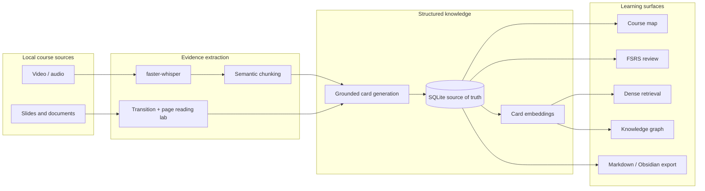

<h1 align="center">Video Course Cards</h1>

<p align="center">
  <strong>A local-first system and research testbed for turning long technical lectures into timestamp-grounded knowledge.</strong>
</p>

<p align="center">
  Video, audio, slides, and documents become evidence-linked cards that can be reviewed, retrieved, connected, and exported without sending the user's knowledge base to a hosted service.
</p>

<p align="center">
  <a href="https://github.com/eatoften/Video_Course_Cards/releases/latest"><strong>Download for Windows</strong></a>
  &nbsp;|&nbsp;
  <a href="docs/Multimodal%20CNN%20ViT%20reader%20study.md">Research report</a>
  &nbsp;|&nbsp;
  <a href="docs/experiments/assignment_5_protocol_results.json">Results artifact</a>
  &nbsp;|&nbsp;
  <a href="docs/tauri-desktop.md">Desktop setup</a>
  &nbsp;|&nbsp;
  <a href="docs/roadmap.md">Roadmap</a>
</p>

<p align="center">
  <a href="https://github.com/eatoften/Video_Course_Cards/releases/latest"></a>
  
  
  
  
  
</p>

## Abstract

Technical lectures are not useful merely because they can be transcribed. A learning system must preserve where a concept came from, distinguish supported claims from fluent inventions, connect related ideas, and retain enough source context for later review.

Video Course Cards studies this problem as both a usable local desktop application and a controlled multimodal research pipeline. The product path performs media validation, speech transcription, semantic chunking, grounded card generation, local retrieval, graph organization, spaced review, and Markdown export. The research path asks a narrower question: **how do visual reading errors propagate into generated learning artifacts?**

The current controlled study compares a handwritten CNN-CTC reader, a parameter-matched handwritten ViT-CTC reader, and a RapidOCR reference on lecture-slide line crops. Models share the same data, tokenizer, CTC head, trainer, evaluator, split, and checkpoint-selection rule. Their predictions are then passed through the same frozen local Qwen card generator and evaluated for concept recovery, claim grounding, citation correctness, and usable-card conversion.

```text
lecture video
  -> timestamped speech and stable slide pages
  -> OCR / semantic evidence
  -> claim-grounded knowledge cards
  -> course map, review, retrieval, graph, and Markdown export
```

## Research Questions

**RQ1.** Under a small, lecture-level OCR dataset, does a CNN's locality bias generalize better than a similarly sized Vision Transformer?

**RQ2.** Do line-level OCR improvements survive the LLM stage and produce measurably better knowledge cards?

**RQ3.** Is character error rate sufficient to predict downstream learning value, or do grounding and page layout introduce independent failure modes?

## Headline Results

### Controlled line recognition

The frozen split contains 1,402 line samples from five independent lectures: Lectures 1-3 are used for training, Lecture 4 for validation-only model selection, and Lecture 5 for one sealed test evaluation.

| Reader | Parameters | CER down | WER down | Exact lines up | Median CPU ms/line down |
| --- | ---: | ---: | ---: | ---: | ---: |
| CNN-CTC v2 | 120,629 | **0.1150** | **0.3155** | **73 / 176** | 4.414 |
| ViT-CTC v1 | 111,253 | 0.4461 | 0.9442 | 5 / 176 | **0.687** |
| RapidOCR stored text | not measured | **0.0071** | **0.0408** | **158 / 176** | not measured |

The paired CNN-minus-ViT CER difference is `-0.3311`, with a 95% lecture-line bootstrap interval of `[-0.4126, -0.2551]`. All 5,000 resamples favor CNN. Both learned readers first passed the same 32-line memorization gate, so the test gap is evidence about generalization rather than a basic inability to optimize.

RapidOCR is a practical recognizer reference, not an end-to-end page-reading result: its stored text uses the same accepted detector polygons as the benchmark. Detection misses and detector latency are therefore outside this comparison.

### OCR-to-card cascade

Each reader's output was reconstructed into the same 16 pages and passed to the same frozen `qwen3:4b` model at temperature zero. Gold concepts were excluded from prompts.

| OCR source | Concept recall up | Grounded claim precision up | Citation correctness up | No-edit acceptance up | Usable conversion up |
| --- | ---: | ---: | ---: | ---: | ---: |
| CNN-CTC v2 | **0.7500** | 0.8667 | 0.6250 | 0.2143 | 0.3750 |
| ViT-CTC v1 | 0.4375 | 0.4375 | 0.0000 | 0.0000 | 0.0000 |
| RapidOCR stored text | **0.7500** | **0.9167** | **0.9231** | **0.8333** | **0.6875** |

The results expose three distinct layers of quality:

1. **OCR quality propagates downstream.** CNN produces substantially more usable cards than the current ViT, while RapidOCR remains the strongest practical reader.
2. **Generation success is not content success.** ViT generated a card for every page, yet none passed the strict usable-card criterion.
3. **CER is necessary but insufficient.** RapidOCR still loses pages to exact-quote grounding failures, and all text-only systems misread the direction of one slide diagram. Layout is an independent information channel.

The sealed OCR comparison is confirmatory under the frozen protocol. The card cascade is explicitly **exploratory**: an infrastructure failure exposed part of Lecture 5 before the final downstream protocol was frozen. See the [full methods, hashes, error slices, and threats to validity](docs/Multimodal%20CNN%20ViT%20reader%20study.md).

## Experimental Design

The study is organized to make invalid comparisons difficult:

- train, validation, and test are separated at the **lecture level**;
- the character vocabulary is fitted on training lectures only;
- CNN and ViT receive identical real and synthetic samples and deterministic augmentation;
- both models emit one CTC time step per four horizontal pixels and reuse one projection head and decoder;
- parameter counts differ by less than 8%;
- checkpoints are selected only by validation `(CER, WER)`;
- test access is claimed in an immutable ledger before inference;
- paired bootstrap operates on matched line or page units;
- configs, datasets, splits, reviews, checkpoints, and reports are hash-bound;
- failed and revised runs remain documented instead of being silently discarded.

The ViT implementation is intentionally explicit: strip patch embedding, learned position embeddings, Q/K/V projection, scaled dot-product multi-head attention, padding masks, residual blocks, and the CTC output path are implemented in [vit_ctc.py](backend/multimodal_lab/models/vit_ctc.py). The CNN and ViT share the same training and evaluation engine under [multimodal_lab/training](backend/multimodal_lab/training).

## System

The research pipeline is embedded in a working local-first learning application rather than an isolated benchmark.



### Product capabilities

- timestamped transcription with faster-whisper;
- embedding-based semantic transcript chunking;
- manual and automatic claim-grounded card generation with local Qwen;
- SQLite persistence for courses, jobs, cards, evidence, notes, relations, and review state;
- card embeddings, dense retrieval, cosine-similarity relations, and graph exploration;
- topic hierarchy and independently scheduled FSRS recall items;
- local PPTX, PDF, DOCX, Markdown, and text sources for concept study documents;
- versioned study documents with evidence citations;
- Obsidian-friendly Markdown folder export;
- React/TypeScript UI packaged as a Tauri Windows application with a FastAPI sidecar.

SQLite is the durable source of truth. Exported Markdown is a portable snapshot, not a second writable database.

## Install the Desktop Demo

Download the latest Windows installer from the [GitHub Releases page](https://github.com/eatoften/Video_Course_Cards/releases/latest).

The installer contains the Tauri shell, React UI, packaged FastAPI backend, and SQLite application code. Large third-party runtimes and model weights are deliberately not bundled. Install the local LLM separately:

```powershell
ollama pull qwen3:4b
```

FFmpeg, Ollama/Qwen, and the configured Sentence Transformer must be available locally for the corresponding features. The application reports missing runtime dependencies in its status view. See [Local LLM setup](docs/local-llm.md) and [desktop packaging notes](docs/tauri-desktop.md).

Desktop data is stored under:

```text
C:\Users\<user>\AppData\Local\Video Course Cards\
```

Current release constraints:

- Windows is the only packaged target exercised;
- the installer is not code-signed;
- model downloads are user-managed;
- Markdown export is one-way and does not synchronize edits back to SQLite.

## Developer Setup

### Prerequisites

- Python 3.11 and [uv](https://docs.astral.sh/uv/)
- Node.js 22 and npm
- FFmpeg and ffprobe
- Ollama with `qwen3:4b`
- Rust/Cargo, MSVC, Windows SDK, and WebView2 only for Tauri builds

```powershell
git clone https://github.com/eatoften/Video_Course_Cards.git
cd Video_Course_Cards
```

Start the backend in one terminal:

```powershell
cd backend
$env:PYTHONUTF8='1'
$env:PYTHONDONTWRITEBYTECODE='1'
uv sync
uv run python -B -m uvicorn app.main:app --host 127.0.0.1 --port 8001 --reload
```

Start the frontend in another terminal:

```powershell
cd frontend
npm.cmd install
npm.cmd run dev
```

Open `http://127.0.0.1:5174`. FastAPI's interactive API documentation is available at `http://127.0.0.1:8001/docs`.

For the desktop shell:

```powershell
powershell -NoProfile -ExecutionPolicy Bypass -File .\scripts\build-desktop-backend.ps1
cd frontend
npm.cmd run tauri:dev
```

## Reproducing the Research Pipeline

Research code lives under `backend/multimodal_lab` and is isolated from production code under `backend/app`. Product services never import a training script.

Run the test suite first:

```powershell
cd backend
uv run pytest
```

Audit the frozen Assignment 5 protocol:

```powershell
uv run python -m multimodal_lab.run_reader_benchmark_protocol audit --protocol multimodal_lab/configs/reader_benchmark_v2_protocol.json --project-root . --output data/multimodal_lab/assignment_5_protocol_audit.json
```

Run the shared 32-line capacity gate:

```powershell
uv run python -m multimodal_lab.run_reader_overfit --config multimodal_lab/configs/reader_cnn_v2.json --output-dir data/multimodal_lab/reader_overfit --device cpu
uv run python -m multimodal_lab.run_reader_overfit --config multimodal_lab/configs/reader_vit_v1.json --output-dir data/multimodal_lab/reader_overfit --device cpu
```

Train with validation-only checkpoint selection:

```powershell
uv run python -m multimodal_lab.run_train_reader --config multimodal_lab/configs/reader_cnn_v2.json --output-dir data/multimodal_lab/reader_training --device cpu --cpu-thread-count 16
uv run python -m multimodal_lab.run_train_reader --config multimodal_lab/configs/reader_vit_v1.json --output-dir data/multimodal_lab/reader_training --device cpu --cpu-thread-count 16
```

The one-time `--open-sealed-test` command is intentionally omitted. Lecture 5 has already been opened under the committed protocol result, and rerunning or tuning against it would violate that experiment's role. New model development must use validation data or define a new held-out lecture before inspecting another test result.

### Artifact availability

Tracked in Git:

- model, trainer, evaluator, and cascade source code;
- versioned experiment and augmentation configs;
- source-audit decisions;
- compact metrics, hashes, run IDs, and validity notes;
- the complete Assignment 5 study report.

Not tracked in Git:

- copyrighted lecture videos;
- extracted frames and line crops;
- generated datasets and full prediction logs;
- optimizer state and model checkpoints;
- local Ollama and Sentence Transformer weights.

These artifacts remain under ignored `backend/data/` directories. A fresh clone can inspect the complete protocol and result provenance, run unit tests, and use the product, but cannot reproduce the exact numerical benchmark without recreating source data that matches the recorded hashes. This limitation is part of the artifact record, not hidden behind an incomplete setup command.

## Repository Layout

```text
Video_Course_Cards/
|-- backend/
|   |-- app/                    # FastAPI product services and SQLite stores
|   |-- multimodal_lab/         # isolated datasets, models, trainers, protocols
|   |-- tests/                  # product and research regression tests
|   `-- data/                   # ignored local data and experiment runs
|-- frontend/
|   |-- src/                    # React/TypeScript learning workspace
|   `-- src-tauri/              # Rust shell and FastAPI sidecar lifecycle
|-- docs/
|   |-- experiments/            # compact machine-readable research results
|   `-- *.md                    # methods, roadmaps, and engineering notes
|-- scripts/                    # desktop build, smoke-test, and release scripts
`-- .github/workflows/          # Windows installer release workflow
```

Important entry points:

| Area | Entry point |
| --- | --- |
| FastAPI | `backend/app/main.py` |
| Desktop backend | `backend/app/desktop_server.py` |
| Video pipeline | `backend/app/video_pipeline.py` |
| Card generation | `backend/app/card_service.py` |
| CNN-CTC | `backend/multimodal_lab/models/cnn_ctc.py` |
| ViT-CTC | `backend/multimodal_lab/models/vit_ctc.py` |
| Shared training | `backend/multimodal_lab/training/reader_trainer.py` |
| Sealed comparison | `backend/multimodal_lab/run_reader_comparison.py` |
| OCR-to-card cascade | `backend/multimodal_lab/run_reader_card_cascade.py` |

## Verification

The Assignment 5 working tree was verified with:

```text
284 passed
```

Additional gates include dataset leakage audits, CTC feasibility checks, model shape and padding tests, finite-gradient tests, 32-line exact overfit, frozen checkpoint hashes, and a one-access test ledger.

## Limitations and Research Status

- Five lectures cover one course and one slide-style family.
- Source-aligned OCR labels still require independent human spot-checking before publication-level claims.
- The RapidOCR comparison excludes page-level detector recall and detector latency.
- The downstream cascade uses slide OCR without aligned lecture audio.
- The card audit has one model-assisted source auditor and no inter-rater reliability measurement.
- Sixteen downstream pages yield wide uncertainty even with paired bootstrap.
- The current ViT result is a small-data baseline, not a claim that Vision Transformers are generally inferior for OCR.

The next defensible multimodal experiment is a newly held-out lecture with a layout-aware or VLM reader, aligned audio evidence, and an independent second card auditor. Product work continues toward citation-grounded RAG and graph-guided retrieval; see the [multimodal plan](docs/Multimodal%20upgrade%20plan.md) and [RAG roadmap](docs/rag-roadmap.md).

## Project Principles

- Local data stays local by default.
- Every generated claim should be traceable to evidence.
- Simple baselines precede complex agents.
- Validation selects models; test data evaluates frozen decisions.
- Failed runs and protocol revisions remain part of the record.
- User corrections become evaluation data before they become training data.

## License

No open-source license has been declared yet. Source availability does not grant permission to redistribute or reuse the code; a license must be selected before a formal public research release.
