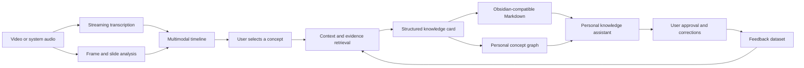
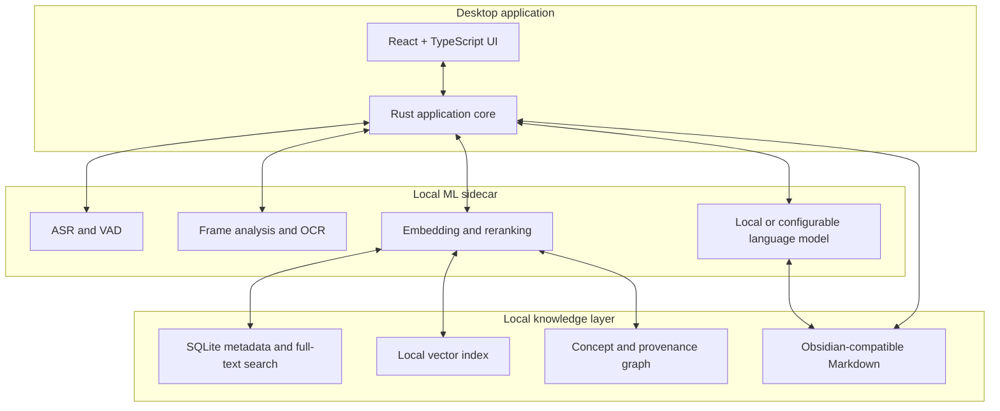

# Video Course Cards

> An on-device multimodal knowledge compiler and personal learning agent that turns video into timestamp-grounded notes and a continuously improving personal knowledge graph.

**Project status:** design and early prototyping.

Video Course Cards is a local-first desktop application for learning from lectures, tutorials, and technical videos. It aligns speech, transcript, visual context, and existing personal notes on a shared timeline, then converts selected concepts into structured, traceable knowledge cards.

Instead of becoming another “chat with your documents” application, the project focuses on a harder workflow:

```text
Observe → Ground → Remember → Act → Learn
```

- **Observe:** understand what is being said and shown in a video.
- **Ground:** attach every generated note to its transcript, frame, and timestamp.
- **Remember:** connect new concepts to an existing personal knowledge base.
- **Act:** let a tool-using assistant search, compare, and propose note updates.
- **Learn:** improve retrieval and note generation from user corrections and choices.

## Product vision

While a video is playing, the application produces incremental captions. A learner can select a term or concept from the transcript, and the system will:

1. collect the surrounding transcript and visual context;
2. identify the concept as it is used in the video;
3. retrieve relevant notes from the learner's local knowledge base;
4. generate a structured note with source evidence;
5. connect the note to related concepts;
6. save it as Obsidian-compatible Markdown;
7. preserve the video title, timestamp, transcript excerpt, and relevant frame.

A later personal knowledge assistant will be able to answer questions such as:

> Compare this lecture's explanation of attention with my previous notes, locate any conflicts, and propose a merged note without changing my files until I approve it.

## Why this project is different

### Multimodal, not transcript-only

A concept may be explained verbally, defined on a slide, and illustrated in a diagram at the same moment. Video Course Cards treats audio, transcript, OCR text, frames, and timestamps as one synchronized source of evidence.

### Provenance-aware by design

Generated knowledge should be traceable. Notes and graph relationships will retain links to the exact video segment that supports them.

### Local-first and human-controlled

Videos, transcripts, embeddings, notes, and feedback remain on the user's device whenever possible. Any operation that changes the knowledge base should be previewable, reversible, and explicitly approved.

### Measurable, not just impressive-looking

The project will evaluate transcription stability, retrieval quality, grounded generation, agent task success, latency, and the effect of personalization against simpler baselines.

## Planned user workflow



## Roadmap

### Milestone 1 — First vertical slice

The first usable version intentionally avoids the hardest operating-system audio-capture problems. It will support a local video file and complete one end-to-end workflow:

- import a local video;
- generate timestamped transcript segments;
- display the transcript next to the video;
- let the user select a word, phrase, or concept;
- generate a structured, source-linked note;
- save the result into an Obsidian vault.

**Definition of done:** a user can move from a video segment to a useful Markdown note without manually copying the transcript, timestamp, or source information.

### Milestone 2 — Streaming multimodal timeline

- system-audio capture where supported;
- voice activity detection and overlapping audio windows;
- incremental ASR with stable-prefix detection;
- provisional versus committed captions;
- slide-change and scene-change detection;
- frame capture and OCR;
- temporal alignment between transcript, frames, and concepts;
- backpressure and latency-aware processing.

### Milestone 3 — Hybrid personal knowledge retrieval

- Markdown ingestion and incremental indexing;
- lexical retrieval for exact terms, code, and formulas;
- dense retrieval for semantic similarity;
- reranking and rank fusion;
- entity resolution for aliases and duplicate concepts;
- provenance-aware concept relationships;
- optional graph expansion during retrieval.

The retrieval stack will be compared against simpler baselines rather than treated as a black box.

### Milestone 4 — Personal knowledge assistant

The assistant will use explicit tools instead of unrestricted file access:

```text
search_transcript(query)
search_notes(query)
open_video_at(timestamp)
get_frame(timestamp)
create_note(draft)
propose_note_patch(path, patch)
link_concepts(source, target)
find_conflicting_notes(concept)
generate_review_questions(concepts)
```

Planned agent properties:

- stateful multi-step execution;
- evidence attached to important claims;
- human approval before writes;
- resumable and inspectable runs;
- idempotent tools and rollback support;
- task-level evaluation rather than subjective demos.

The initial implementation will favor a small, explicit state machine. A dedicated agent framework will be introduced only when persistence, branching, interruption, or recovery makes it necessary.

### Milestone 5 — Learning from user feedback

The system will record useful supervision signals with user consent:

- original generated note versus final edited note;
- accepted and rejected concept links;
- selected and skipped retrieval results;
- transcript corrections;
- accepted and rejected agent proposals.

Potential experiments include:

1. **Retriever fine-tuning** with clicked notes as positives and difficult non-selected notes as hard negatives.
2. **Reranker training** for concept-specific retrieval over personal notes.
3. **Parameter-efficient supervised fine-tuning** for preferred note structure and explanation depth.
4. **Preference optimization** after enough high-quality chosen/rejected response pairs have been collected.

Personalization will only be kept when it produces a measurable improvement over the non-personalized baseline.

## Proposed architecture



## Candidate technology stack

| Layer | Candidate technologies | Responsibility |
|---|---|---|
| Desktop shell | Tauri | Packaging, permissions, native integration, sidecar lifecycle |
| Interface | React, TypeScript, Vite | Video player, transcript, timeline, graph, note review |
| Systems layer | Rust | Audio streaming, ring buffers, concurrency, IPC, file access |
| ML layer | Python, PyTorch | ASR, OCR, multimodal processing, retrieval, training, evaluation |
| Local inference | whisper.cpp or a Whisper-compatible runtime; Ollama or llama.cpp | On-device transcription, embeddings, and generation |
| Storage | SQLite, full-text search, local vector index | Metadata, lexical search, embeddings, evaluation traces |
| Knowledge output | Markdown and Obsidian links | Portable user-owned notes |
| Agent orchestration | Explicit state machine first; LangGraph if justified | Tool execution, persistence, interruption, approval |
| Fine-tuning | PEFT/LoRA and preference-training tooling | Efficient personalization experiments |

These choices are provisional. Each dependency should earn its place through a concrete requirement or benchmark.

## Knowledge representation

A generated card may look like this:

```md
---
id: concept-learning-rate
aliases:
  - step size
source_video: machine-learning-lecture-03.mp4
source_timestamp: 00:14:31
created_at: 2026-06-20
---

# Learning Rate

## Definition
The learning rate controls the size of each parameter update during optimization.

## In this lecture
The instructor uses the learning rate to explain why gradient descent can either
converge slowly or overshoot a minimum.

## Connections
- [[Gradient Descent]]
- [[Loss Function]]
- [[Convergence]]

## Evidence
- Timestamp: `00:14:31`
- Transcript: “...”
- Frame: `assets/machine-learning-lecture-03/00-14-31.webp`

## Open questions
- How should the learning rate change during training?
```

Concept relationships will also retain provenance and confidence instead of being stored as unsupported edges:

```text
Learning Rate --controls_update_size_of--> Gradient Descent
               source: lecture-03 @ 00:14:31
               confidence: 0.91
```

## Evaluation plan

| Component | Primary metrics |
|---|---|
| Streaming transcription | WER, real-time factor, end-to-end latency, revision rate, committed-prefix stability |
| Temporal alignment | timestamp error, frame-to-transcript alignment accuracy |
| Retrieval | Recall@K, MRR, nDCG, latency |
| Entity resolution | precision, recall, duplicate-concept reduction |
| Note generation | citation coverage, unsupported-claim rate, user edit distance, acceptance rate |
| Agent | task success rate, tool failure rate, approval rate, rollback correctness |
| Personalization | improvement over frozen baseline on held-out user feedback |

Planned retrieval ablations:

```text
A. Dense retrieval only
B. Lexical + dense retrieval
C. Lexical + dense + reranker
D. Hybrid retrieval + graph expansion
```

Every advanced component should demonstrate an improvement in quality, latency, memory usage, or user effort.

## Engineering and research questions

This project is intended to explore several non-trivial questions:

- How can a non-streaming ASR model provide stable, low-latency captions?
- How should transcript revisions propagate through a live timeline without corrupting notes?
- How can visual and spoken evidence be aligned at concept level?
- When does graph expansion improve retrieval, and when does it introduce noise?
- How can personal corrections become training data without overfitting to a tiny history?
- How should an agent prove what it found before it is allowed to modify a knowledge base?
- What is the smallest local model that satisfies interactive latency and quality targets?

## Privacy and safety principles

- Local processing is preferred by default.
- The user owns the source videos, notes, indexes, and feedback data.
- External model providers, when supported, must be opt-in and clearly disclosed.
- Generated notes must retain evidence links where possible.
- Agent writes require preview and approval.
- Destructive operations must support rollback.
- Training data collection must be explicit and inspectable.

## Current scope

The repository is currently at the project-definition stage. The immediate goal is not to implement every planned component. It is to build the smallest end-to-end vertical slice that validates the central interaction:

```text
Local video → timestamped transcript → selected concept → grounded note → Obsidian
```

Real-time system-audio capture, graph retrieval, autonomous tool use, and model fine-tuning will be added only after this workflow is reliable and measurable.

## Non-goals for the first release

- a fully autonomous multi-agent system;
- automatic modification of user notes without approval;
- support for every operating system and audio source;
- cloud-only storage;
- fine-tuning before a useful feedback dataset exists;
- adding frameworks solely for résumé keywords.

## Contributing

The project is in an early design phase. Architecture decisions, evaluation datasets, and the first vertical slice will be documented as they are implemented.

## License

To be determined before the first public release.
