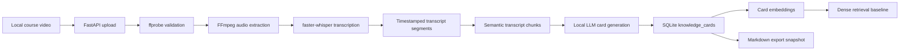
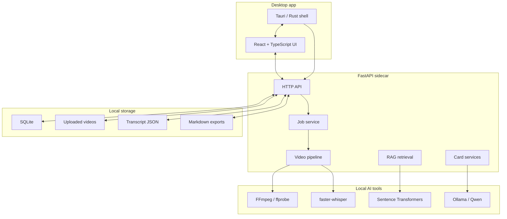

# Video Course Cards

> Local-first AI learning workspace for turning long course videos into timestamp-grounded knowledge cards, searchable card memory, and portable Markdown study notes.

Video Course Cards is a Windows desktop demo and research prototype. It takes a local lecture video, validates it with FFmpeg/ffprobe, transcribes it with Whisper, stores the workflow in SQLite, generates claim-grounded knowledge cards with a local LLM, embeds cards with Sentence Transformers, and exports the result as Obsidian-friendly Markdown.

The current product shape is:

```text
local video
-> transcript
-> semantic transcript chunks
-> grounded knowledge cards
-> card embeddings
-> simple card-based RAG retrieval
-> Markdown export snapshot
```

The project is intentionally local-first:

- user videos stay on the user's machine;
- SQLite is the source of truth;
- Markdown files are portable export snapshots;
- local models are preferred through Ollama and Sentence Transformers;
- generated claims keep evidence and timestamps instead of becoming unsupported notes.

## Current Status

This repository has a working end-to-end demo, not just a mockup.

Implemented:

- Windows desktop shell with Tauri.
- FastAPI backend packaged as a Tauri sidecar.
- React + TypeScript frontend.
- SQLite persistence for courses, uploaded video jobs, transcript chunks, cards, notes, embeddings, and generation runs.
- Local video upload and ffprobe validation.
- FFmpeg audio extraction.
- faster-whisper transcription.
- Transcript timeline UI with selectable segments.
- Semantic transcript chunking with Sentence Transformer embeddings.
- Manual and automatic knowledge-card generation.
- Claim-level grounding: each card claim can carry supporting transcript evidence and timestamps.
- Card editing, deletion, tags, review state, and user notes.
- Course-level card rail and card detail editing.
- Card embeddings and dense retrieval baseline for RAG.
- Markdown export for one job or all cards.
- Runtime setup checklist for FFmpeg, ffprobe, Ollama/Qwen, embedding model, and Whisper runtime.
- Windows NSIS installer build.

Not yet production-ready:

- no signed installer;
- Windows is the only packaged target currently tested;
- local model setup is still a user-managed step;
- Markdown exports do not sync edits back into SQLite;
- RAG currently retrieves relevant cards, but does not yet run a fully cited answer-generation assistant.

## Install The Desktop Demo

The intended user flow is:

```text
GitHub Releases -> download Windows installer -> double-click -> launch app
```

Release page:

```text
https://github.com/eatoften/Video_Course_Cards/releases
```

The lightweight installer includes:

- Tauri desktop shell;
- React UI;
- packaged FastAPI backend sidecar;
- SQLite schema and application code.

It does not bundle large local AI assets:

- Ollama is installed separately;
- Qwen model files are installed separately;
- Sentence Transformer model cache is installed separately;
- user videos and generated data are never bundled into the installer.

Desktop user data is stored under:

```text
C:\Users\<user>\AppData\Local\Video Course Cards\
```

Typical first local model command:

```powershell
ollama pull qwen3:4b
```

More details are in [docs/tauri-desktop.md](docs/tauri-desktop.md) and [docs/local-llm.md](docs/local-llm.md).

## Developer Quick Start

### Prerequisites

- Python 3.11
- uv
- Node.js + npm
- FFmpeg and ffprobe on `PATH`
- Ollama for local LLM card generation
- Rust/Cargo + MSVC build tools for Tauri desktop builds

Check Tauri prerequisites:

```powershell
cd path\to\Video_Course_Cards\frontend
npm.cmd exec tauri info
```

### Run Backend From Source

```powershell
cd path\to\Video_Course_Cards\backend
$env:PYTHONUTF8='1'
$env:PYTHONDONTWRITEBYTECODE='1'
uv run python -B -m uvicorn app.main:app --host 127.0.0.1 --port 8001 --reload
```

Health check:

```powershell
Invoke-WebRequest -UseBasicParsing http://127.0.0.1:8001/health
```

### Run Frontend From Source

```powershell
cd path\to\Video_Course_Cards\frontend
npm.cmd install
npm.cmd run dev
```

Open:

```text
http://127.0.0.1:5174
```

### Run Tauri Desktop Dev Mode

Build the backend sidecar first:

```powershell
cd path\to\Video_Course_Cards
powershell -NoProfile -ExecutionPolicy Bypass -File .\scripts\build-desktop-backend.ps1
```

Then start the desktop app:

```powershell
cd path\to\Video_Course_Cards\frontend
npm.cmd run tauri:dev
```

In desktop mode, Tauri starts or reuses the local FastAPI backend automatically.

## Build The Windows Installer

Local build:

```powershell
cd path\to\Video_Course_Cards
powershell -NoProfile -ExecutionPolicy Bypass -File .\scripts\build-windows-installer.ps1
```

If the backend sidecar has already been built:

```powershell
powershell -NoProfile -ExecutionPolicy Bypass -File .\scripts\build-windows-installer.ps1 -SkipBackendBuild
```

Expected output:

```text
frontend\src-tauri\target\release\bundle\nsis\Video Course Cards_0.1.0_x64-setup.exe
```

The repo also includes a GitHub Actions workflow:

```text
.github/workflows/windows-desktop-release.yml
```

Manual release helper:

```powershell
gh auth login
powershell -NoProfile -ExecutionPolicy Bypass -File .\scripts\publish-github-release.ps1 -Tag v0.1.0
```

Automatic tag release:

```powershell
git tag v0.1.0
git push origin v0.1.0
```

The workflow builds the Windows installer and attaches it to the tag's GitHub Release.

## How The App Works



The important design rule is:

```text
SQLite is the database.
Markdown is an export format.
```

That means the app edits cards in SQLite, then exports Markdown when the user wants portable files for Obsidian or sharing.

## Architecture



Repository layout:

```text
backend/
  app/
    main.py                         FastAPI routes
    job_service.py                  video job orchestration
    job_store.py                    SQLite CRUD for jobs
    video_pipeline.py               probe -> audio -> transcribe -> save
    transcript_chunker.py           semantic transcript chunking
    knowledge_card_service.py       card persistence workflow
    card_embedding_service.py       card -> embedding pipeline
    rag_service.py                  card retrieval baseline
    desktop_server.py               packaged sidecar entrypoint

frontend/
  src/
    App.tsx                         main React app
    App.css                         application styling
  src-tauri/                        Tauri desktop shell

scripts/
  build-desktop-backend.ps1         PyInstaller backend sidecar build
  test-desktop-backend.ps1          sidecar smoke test
  build-windows-installer.ps1       full desktop installer build
  publish-github-release.ps1        draft GitHub release helper

docs/
  roadmap.md                        long-term roadmap
  rag-roadmap.md                    RAG baseline plan
  tauri-desktop.md                  desktop packaging notes
  local-llm.md                      Ollama / local LLM setup
```

## Core API Surface

The backend exposes routes for:

- `GET /health`
- `GET /runtime/status`
- `POST /runtime/check`
- `GET /llm/status`
- `GET /llm/models`
- `POST /videos`
- `GET /jobs`
- `POST /jobs/{job_id}/run`
- `POST /jobs/{job_id}/retry`
- `GET /jobs/{job_id}/transcript`
- `POST /jobs/{job_id}/chunks`
- `POST /jobs/{job_id}/cards/auto-generate`
- `GET /jobs/{job_id}/cards`
- `POST /jobs/{job_id}/cards`
- `PATCH /cards/{card_id}`
- `DELETE /cards/{card_id}`
- `POST /cards/{card_id}/embedding`
- `POST /courses/{course_id}/card-embeddings`
- `POST /rag/retrieve`
- `GET /jobs/{job_id}/cards/export/markdown`
- `POST /jobs/{job_id}/cards/export/markdown/folder`
- `GET /cards/export/markdown`
- `POST /cards/export/markdown/folder`

## Data Model Overview

The current SQLite-backed model includes:

- courses;
- video jobs;
- transcript records;
- semantic transcript chunks;
- knowledge cards;
- card claims and evidence;
- user notes attached to cards;
- card embeddings;
- automatic card generation runs.

Knowledge cards are structured records rather than loose text blobs. A card contains a title, summary, tags, source job, source timestamp range, active-recall question and answer, and grounded claims.

Example card shape:

```json
{
  "title": "Singular Value Decomposition",
  "summary": "SVD factors a matrix into orthogonal and diagonal structure.",
  "tags": ["linear algebra", "matrix factorization"],
  "source_start_seconds": 724.0,
  "source_end_seconds": 738.0,
  "claims": [
    {
      "text": "SVD decomposes a matrix using orthogonal and diagonal components.",
      "evidence": [
        {
          "text": "called the singular value decomposition",
          "start_seconds": 724.0,
          "end_seconds": 738.0
        }
      ]
    }
  ],
  "question": "What structure does SVD use to factor a matrix?",
  "answer": "It uses orthogonal matrices and a diagonal matrix."
}
```

## Testing

Backend tests:

```powershell
cd path\to\Video_Course_Cards\backend
uv run pytest
```

Frontend build:

```powershell
cd path\to\Video_Course_Cards\frontend
npm.cmd run build
```

Tauri Rust check:

```powershell
cd path\to\Video_Course_Cards\frontend\src-tauri
cargo check
```

Sidecar smoke test:

```powershell
cd path\to\Video_Course_Cards
powershell -NoProfile -ExecutionPolicy Bypass -File .\scripts\test-desktop-backend.ps1
```

## Configuration

Common backend environment variables:

```env
VCC_DATA_DIR=
VCC_DB_PATH=
VCC_UPLOAD_DIR=
VCC_TRANSCRIPT_DIR=
VCC_EXPORT_DIR=
VCC_LOG_DIR=
VCC_BACKEND_LOG_FILE=
VCC_DESKTOP=false
OLLAMA_BASE_URL=http://localhost:11434
OLLAMA_MODEL=qwen3:4b
```

Development mode defaults to repo-local data under `backend/data`.

Desktop mode defaults to:

```text
C:\Users\<user>\AppData\Local\Video Course Cards\
```

## Roadmap

Near-term:

- improve automatic transcript chunk quality;
- improve grounded card generation quality and latency;
- add duplicate-card detection with embeddings;
- show related cards in the UI;
- turn card retrieval into a grounded answer-generation RAG assistant;
- add evaluation records for unsupported claims, duplicate cards, generation latency, and retrieval hit rate.

Longer-term:

- build a card similarity graph;
- add relationship types such as prerequisite, related, example_of, contrast_with, and part_of;
- support human-in-the-loop knowledge graph editing;
- use user corrections as a feedback dataset;
- compare ordinary RAG against graph-guided retrieval and future agentic learning loops.

See:

- [docs/roadmap.md](docs/roadmap.md)
- [docs/rag-roadmap.md](docs/rag-roadmap.md)
- [docs/tauri-desktop.md](docs/tauri-desktop.md)

## Why This Project Matters

Many learning tools stop at "chat with a transcript." This project is aimed at a more structured loop:

```text
watch -> transcribe -> ground claims -> save cards -> retrieve related cards -> evaluate failures -> improve
```

The research angle is not merely calling an LLM API. The interesting parts are:

- local-first model orchestration;
- evidence-grounded generation;
- semantic chunking for long lectures;
- card-level embedding and retrieval;
- SQLite-backed personal knowledge memory;
- portable Markdown export;
- future graph-guided and feedback-trained learning systems.

## Privacy Principles

- Keep user videos local.
- Keep generated cards and embeddings local by default.
- Make external model providers opt-in.
- Keep evidence attached to generated claims.
- Treat Markdown export as a user-owned artifact.
- Avoid hidden writes to a user's knowledge base.

## License

To be determined before the first public release.
