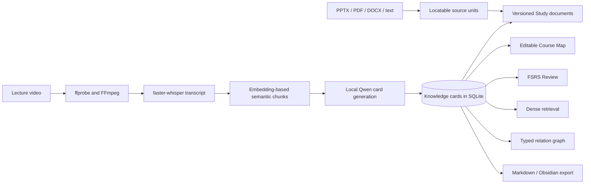
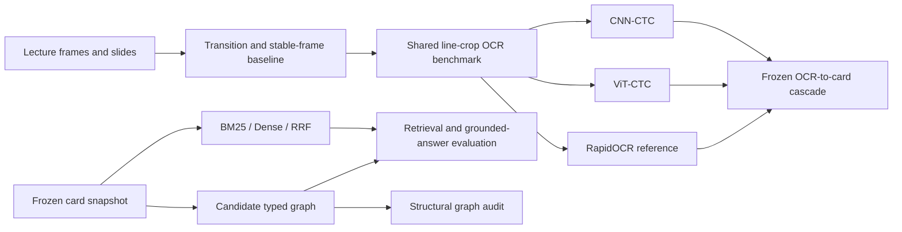

<h1 align="center">Video Course Cards</h1>

<p align="center">
  <strong>An evidence-centered course learning system built around inspectable knowledge cards.</strong>
</p>

<p align="center">
  The application turns timestamped lecture transcripts into editable claim-evidence units and reuses those units across course maps, source-backed study documents, spaced review, retrieval, typed relations, and portable export. Separate research packages test what is lost or gained at three boundaries: course evidence to cards, questions to evidence, and cards to navigable course structure.
</p>

<p align="center">
  <a href="https://github.com/eatoften/Video_Course_Cards/releases/latest"><strong>Windows release</strong></a>
  &nbsp;|&nbsp;
  <a href="docs/Multimodal%20CNN%20ViT%20reader%20study.md">Multimodal report</a>
  &nbsp;|&nbsp;
  <a href="docs/RAG%20retrieval%20and%20graph%20study.md">RAG report</a>
  &nbsp;|&nbsp;
  <a href="docs/Graph%20as%20associative%20knowledge%20structure.md">Graph hypotheses</a>
  &nbsp;|&nbsp;
  <a href="docs/roadmap.md">Roadmap</a>
</p>

<p align="center">
  <a href="https://github.com/eatoften/Video_Course_Cards/releases/latest"></a>
  
  
  
  
  
</p>

## Why This Representation

A transcript is rich in evidence but awkward to navigate and review. A free-form
summary is compact but can discard provenance. Video Course Cards uses a
`KnowledgeCard` as the intermediate representation between raw course material
and later learning tasks:

```json
{
  "id": "card_...",
  "card_kind": "concept",
  "title": "Singular Value Decomposition",
  "summary": "An important matrix factorization discussed with orthogonal and diagonal structure.",
  "claims": [
    {
      "id": "claim_...",
      "text": "SVD is an important matrix factorization.",
      "evidence": [
        {
          "id": "evidence_...",
          "quote": "That's a very important factorization called the singular value decomposition.",
          "segment_start_seconds": 724.0,
          "segment_end_seconds": 738.0
        }
      ]
    }
  ]
}
```

Claims and evidence have stable IDs. Cards remain editable and can own multiple
independently scheduled recall prompts. SQLite is the source of truth; Markdown
and Obsidian exports are portable snapshots.

This representation connects parts of the application that would otherwise be
separate demos:

```text
timestamped transcript -> claims and evidence -> KnowledgeCard
KnowledgeCard -> Course Map | Study | Review | Retrieve | Explore | Export
```

Imported PPTX, PDF, DOCX, Markdown, and text files currently provide cited
source units for Study documents. Direct visual evidence to card generation is
implemented in the experimental pipeline, not yet in the desktop product.

## Research Program

The unifying question is not simply whether an LLM can summarize a lecture:

> How can course evidence be compressed into durable learning units without
> losing provenance, and which representations help a learner organize,
> retrieve, and revisit those units?

The repository studies that question through three linked but separately
evaluated problems:

1. **Evidence acquisition:** under a controlled small-data protocol, how do
   visual readers preserve slide text, and how do their errors propagate into
   concepts, claims, citations, and usable cards?
2. **Evidence retrieval:** when cards are the retrieval unit, how do BM25,
   dense embeddings, rank fusion, and graph expansion compare under the same
   evidence budget?
3. **Knowledge organization:** when do hierarchy and typed card relations add
   useful structure beyond nearest-neighbor similarity, especially for
   exploration, prerequisite paths, and review planning?

These are not presented as one finished scientific claim. The OCR reader study
has one sealed lecture-level evaluation. The card cascade and RAG results are
exploratory. The graph work currently establishes a measurement protocol and
scale hypotheses, not a demonstrated memory advantage.

## System

### Product path



### Research path



Product and research code are deliberately separated:

```text
backend/app              FastAPI services, SQLite workflows, local application
backend/multimodal_lab   datasets, CNN/ViT readers, trainers, sealed protocols
backend/rag_lab          frozen corpora, retrieval baselines, metrics, audits
```

## Evidence At A Glance

| Study or artifact | Evidence unit | Status | Supported conclusion |
| --- | --- | --- | --- |
| Windows desktop application | End-to-end local workflow | Product prototype, `v0.1.1` | The current card-centered workflow is runnable as an installable local application |
| CNN vs ViT reader | 176 held-out lines from Lecture 5 | Sealed once under the recorded protocol | The matched CNN generalizes better than the matched scratch ViT in this small-data setting |
| OCR-to-card cascade | 16 reconstructed pages, 48 generations | Exploratory | OCR and layout errors can survive valid JSON generation and damage card utility |
| Retrieval baselines | 40 development questions over 118 cards | Exploratory, candidate labels | Dense retrieval is the strongest current direct-QA baseline |
| Graph expansion | 8 development multi-hop questions | Exploratory, candidate graph | Expansion trades better multi-hop coverage for worse ordinary ranking in this sample |
| Graph organization audit | 118 cards and 20 candidate edges | Hypothesis-forming | Some typed edges are nonlocal to Dense top-5, but the graph is too sparse for a scale claim |

## Experimental Results

### 1. Small-data slide-line recognition

The controlled reader dataset contains 1,402 line crops from five CS231n
lectures. Lectures 1-3 form training data, Lecture 4 is validation-only, and
Lecture 5 was opened once for sealed evaluation. CNN and ViT use the same real
and synthetic training data, tokenizer, augmentation, CTC projection and
decoder, trainer, checkpoint rule, and approximately matched parameter count.

| Reader | Parameters | CER down | WER down | Exact lines up | Median CPU ms/line down |
| --- | ---: | ---: | ---: | ---: | ---: |
| CNN-CTC v2 | 120,629 | **0.1150** | **0.3155** | **73 / 176** | 4.414 |
| ViT-CTC v1 | 111,253 | 0.4461 | 0.9442 | 5 / 176 | **0.687** |
| RapidOCR stored text | not measured | **0.0071** | **0.0408** | **158 / 176** | not measured |

CNN minus ViT CER is `-0.3311`, with a paired 95% bootstrap interval of
`[-0.4126, -0.2551]`; all 5,000 bootstrap resamples favor CNN. Both models
first passed the same 32-line exact-overfit gate.

This result supports a data-regime conclusion, not a universal claim that CNNs
are better than ViTs. The scratch ViT is faster here but generalizes poorly from
the available lecture-line data. RapidOCR is a practical pretrained reference,
not a fully matched system: its stored text is evaluated on already accepted
detector polygons, so detector recall and detector latency are excluded.

### 2. Reader errors after card generation

Predicted lines were reconstructed into the same 16 pages and passed to frozen
`qwen3:4b` generation at temperature zero. Gold concepts were not included in
the prompt.

| OCR source | Concept recall up | Grounded claim precision up | Citation correctness up | Usable-card conversion up |
| --- | ---: | ---: | ---: | ---: |
| CNN-CTC v2 | **0.7500** | 0.8667 | 0.6250 | 0.3750 |
| ViT-CTC v1 | 0.4375 | 0.4375 | 0.0000 | 0.0000 |
| RapidOCR stored text | **0.7500** | **0.9167** | **0.9231** | **0.6875** |

The main observation is an interface failure: all 16 ViT inputs produced
parseable card outputs, yet none met the usable-card criterion. Syntactic
generation success therefore does not establish concept recovery, grounding,
or citation quality. Errors involving formulas, arrows, grouping, and layout
also show why character accuracy alone cannot describe slide understanding.

This cascade is exploratory because it contains 16 pages, follows an
infrastructure revision, and uses one model-assisted source auditor. The
reader comparison remains the sealed result; downstream card metrics do not.

Methods, hashes, error slices, and threats to validity are recorded in the
[multimodal report](docs/Multimodal%20CNN%20ViT%20reader%20study.md) and
[compact protocol artifact](docs/experiments/assignment_5_protocol_results.json).

### 3. Card retrieval under a fixed budget

The RAG development study snapshots 118 cards, 140 claims, and 150 evidence
spans. The candidate benchmark contains 100 questions; the table below uses the
40-question development split. The 60-question test split remains blocked
until question, evidence, claim, and graph annotations receive independent
human review.

| Retrieval system | Recall@5 up | MRR up | nDCG@5 up | Multi-hop joint R@3 up |
| --- | ---: | ---: | ---: | ---: |
| BM25 | 0.859 | 0.737 | 0.746 | 0.375 |
| Dense MiniLM | **1.000** | **0.901** | **0.924** | 0.750 |
| BM25 + Dense RRF | 0.969 | 0.891 | 0.898 | 0.500 |
| Dense + noisy graph | **1.000** | 0.875 | 0.904 | 0.750 |
| Dense + candidate graph | **1.000** | 0.805 | 0.852 | **0.875** |

Dense retrieval is the strongest current direct-question baseline. Candidate
graph expansion increases multi-hop joint Recall@3 by `0.125` on eight
development questions, while reducing single-card nDCG@5 by `0.163`. The
corresponding bootstrap intervals are `[0.000, 0.375]` and
`[-0.255, -0.077]`.

With the same top-5 context, prompt, Qwen digest, and character budget, graph
expansion changes eight answers but yields only one gold-claim citation-recall
win, 39 ties, and no multi-hop answer gain. Prompt-only refusal fails on all
eight unsupported questions; a development-calibrated pre-generation Dense
confidence gate reaches `0.984` abstention F1. Neither result is a held-out test
claim.

See the [RAG report](docs/RAG%20retrieval%20and%20graph%20study.md),
[machine-readable results](docs/experiments/), and
[RAG reproduction commands](backend/rag_lab/README.md).

### 4. Typed graph as an organization hypothesis

The same candidate graph was audited independently of QA reranking:

| Structural measurement | Result |
| --- | ---: |
| Cards covered by a candidate edge | 32 / 118, 27.1% |
| Isolated cards | 86 |
| Largest connected component | 4 cards |
| Candidate-edge mean cosine | 0.515 |
| Lecture-matched random non-edge mean cosine | 0.267 |
| Edges with at least one endpoint outside Dense top-5 | 9 / 20, 45.0% |

The graph is coherent enough to study but far too sparse to establish a
large-scale associative-memory result. The current evidence supports a narrower
hypothesis: typed relations may expose prerequisite, part-whole, contrast, and
example structure that nearest-neighbor retrieval does not rank highly. Whether
that structure improves exploration, curriculum sequencing, review, or learning
must be tested at larger corpus sizes with independently verified edges and
task-specific metrics.

The null baseline, scale protocol, and explicit falsification conditions are in
[Graph as an Associative Knowledge Structure](docs/Graph%20as%20associative%20knowledge%20structure.md).

## Application

The current desktop application supports:

- video validation with `ffprobe`, FFmpeg audio extraction, and timestamped
  faster-whisper transcription;
- embedding-based transcript chunking and manual or automatic grounded-card
  generation with local Qwen;
- SQLite persistence for courses, jobs, transcripts, cards, stable claims and
  evidence, notes, source assets, topics, relations, and review state;
- an editable hierarchical Course Map and embedding-assisted topic suggestions;
- versioned Study documents around card anchors, with citations into imported
  PPTX, PDF, DOCX, Markdown, and text sources;
- multiple recall prompts per card and independent FSRS scheduling;
- related-card retrieval, typed relation editing, and graph exploration;
- card retrieval in the application, plus controlled answer generation in the
  isolated RAG lab;
- Obsidian-friendly Markdown export;
- a React/TypeScript interface packaged with Tauri and a FastAPI sidecar.

All user data stays on the local machine by default. Ollama and Sentence
Transformer models are local dependencies rather than hosted APIs.

## Installation

Download the Windows installer from the
[latest GitHub release](https://github.com/eatoften/Video_Course_Cards/releases/latest).

The installer includes the Tauri shell, React interface, packaged FastAPI
backend, and SQLite application. Model weights and large third-party runtimes
are not bundled. Install the default local generation model separately:

```powershell
ollama pull qwen3:4b
```

FFmpeg, Ollama/Qwen, and the configured Sentence Transformer must be available
for the features that use them. The application exposes a runtime status check;
see [Local LLM setup](docs/local-llm.md) and
[desktop packaging](docs/tauri-desktop.md).

Desktop data is stored under:

```text
C:\Users\<user>\AppData\Local\Video Course Cards\
```

Current release constraints:

- Windows is the only packaged target exercised;
- the installer is not code-signed;
- model installation remains user-managed;
- Markdown export is one-way and does not synchronize edits into SQLite.

## Developer Quickstart

Requirements: Python 3.11, [uv](https://docs.astral.sh/uv/), Node.js 22,
FFmpeg, and Ollama. Rust, MSVC, the Windows SDK, and WebView2 are needed only
for desktop builds.

```powershell
git clone https://github.com/eatoften/Video_Course_Cards.git
cd Video_Course_Cards
```

Start FastAPI:

```powershell
cd backend
$env:PYTHONUTF8='1'
$env:PYTHONDONTWRITEBYTECODE='1'
uv sync
uv run python -B -m uvicorn app.main:app --host 127.0.0.1 --port 8001 --reload
```

Start React in a second terminal:

```powershell
cd frontend
npm.cmd install
npm.cmd run dev
```

Open `http://127.0.0.1:5174`. FastAPI documentation is available at
`http://127.0.0.1:8001/docs`.

Run the Tauri shell:

```powershell
powershell -NoProfile -ExecutionPolicy Bypass -File .\scripts\build-desktop-backend.ps1
cd frontend
npm.cmd run tauri:dev
```

## Reproducibility

Run backend regression tests first:

```powershell
cd backend
uv run pytest
```

Current verification: `302 passed`. The remaining warning comes from the
installed Starlette/httpx TestClient compatibility layer.

| Study | Implementation | Protocol and report |
| --- | --- | --- |
| Transition and page-reading baselines | `backend/multimodal_lab/transition_baseline.py`, `page_reading.py` | [Multimodal plan and records](docs/Multimodal%20upgrade%20plan.md) |
| CNN-CTC vs ViT-CTC | `backend/multimodal_lab/models/` | [Reader study](docs/Multimodal%20CNN%20ViT%20reader%20study.md) |
| OCR-to-card cascade | `backend/multimodal_lab/reader_card_cascade.py` | [Assignment 5 artifact](docs/experiments/assignment_5_protocol_results.json) |
| Retrieval and grounded answers | `backend/rag_lab/` | [RAG lab commands](backend/rag_lab/README.md) |
| Graph organization audit | `backend/rag_lab/graph_organization.py` | [Graph study](docs/Graph%20as%20associative%20knowledge%20structure.md) |

The experiment lifecycle is:

```text
versioned protocol
-> input and leakage audit
-> train or development decisions
-> frozen evaluation gate
-> compact metrics, hashes, failures, and validity notes
```

Generated videos, frames, line crops, transcripts, embeddings, checkpoints,
and full prediction logs remain in ignored `backend/data/` directories. Git
tracks code, protocol versions, source-review decisions, compact results,
run IDs, hashes, and limitations. Because the lecture media cannot be
redistributed, a fresh clone can inspect provenance and run tests but cannot
reproduce the exact OCR numbers without recreating inputs that match the
recorded hashes.

The Lecture 5 OCR test has already been opened once and is closed to further
tuning. The RAG candidate test runner remains blocked until its benchmark and
graph annotations are independently reviewed and sealed.

## Repository Map

```text
Video_Course_Cards/
|-- backend/
|   |-- app/                    # FastAPI product and SQLite services
|   |-- multimodal_lab/         # datasets, readers, training, protocols
|   |-- rag_lab/                # corpora, retrievers, metrics, graph audits
|   |-- tests/                  # product and research regression tests
|   `-- data/                   # ignored user data and experiment runs
|-- frontend/
|   |-- src/                    # React/TypeScript learning workspace
|   `-- src-tauri/              # Rust shell and sidecar lifecycle
|-- docs/
|   |-- experiments/            # compact machine-readable results
|   `-- *.md                    # reports, roadmaps, engineering notes
|-- scripts/                    # desktop build and smoke-test scripts
`-- .github/workflows/          # tagged Windows release build
```

Important entry points:

| Area | Entry point |
| --- | --- |
| FastAPI application | `backend/app/main.py` |
| Video processing | `backend/app/video_pipeline.py` |
| Semantic chunking | `backend/app/transcript_chunker.py` |
| Grounded card generation | `backend/app/card_service.py` |
| Card persistence | `backend/app/knowledge_card_store.py` |
| Dense product retrieval | `backend/app/rag_service.py` |
| CNN-CTC and ViT-CTC | `backend/multimodal_lab/models/` |
| Shared reader trainer | `backend/multimodal_lab/training/reader_trainer.py` |
| Retrieval baselines | `backend/rag_lab/retrievers.py` |
| RAG metrics | `backend/rag_lab/metrics.py` |
| Graph audit | `backend/rag_lab/graph_organization.py` |

## Claim Boundaries

The current evidence supports these statements:

- the repository contains a working local card-centered learning application;
- under one frozen five-lecture protocol, the matched CNN reader outperforms
  the matched scratch ViT reader on the sealed lecture;
- on the candidate RAG development split, Dense is the strongest direct-QA
  baseline and unconditional graph expansion introduces a ranking tradeoff;
- some candidate typed edges capture relations outside Dense top-5.

It does **not** yet establish that:

- CNNs are generally better than ViTs for slide reading;
- the visual pipeline is integrated into the released desktop workflow;
- the candidate RAG labels and graph edges are independently human verified;
- graph traversal improves answer quality or learner outcomes;
- exact numerical experiments are reproducible without the source lectures.

## Next Experiments

1. Complete independent review of RAG questions, claims, evidence, and graph
   decisions, freeze thresholds, and open the test split once.
2. Add a genuinely held-out multimodal lecture with aligned audio and slides,
   layout-aware reading, and a second independent card auditor.
3. Grow frozen card-corpus snapshots and test when direct retrieval, typed
   traversal, or a task router is preferable under equal budgets.
4. Compare graph-supported exploration and prerequisite paths using discovery,
   path precision, prerequisite violations, delayed recall, and time-to-mastery.
5. Preserve user corrections, review outcomes, and citation edits as an
   evaluation dataset before attempting policy learning or agentic retrieval.

## Documentation

| Document | Scope |
| --- | --- |
| [Multimodal CNN/ViT Reader Study](docs/Multimodal%20CNN%20ViT%20reader%20study.md) | Controlled reader protocol, results, cascade, error analysis |
| [Card Retrieval and Graph RAG Study](docs/RAG%20retrieval%20and%20graph%20study.md) | Candidate benchmark, baselines, grounded generation, R4 comparison |
| [Graph as an Associative Knowledge Structure](docs/Graph%20as%20associative%20knowledge%20structure.md) | Structural audit, hypotheses, scale study, falsification conditions |
| [RAG Research Roadmap](docs/rag-roadmap.md) | Human-review gate and later retrieval experiments |
| [Multimodal Upgrade Plan](docs/Multimodal%20upgrade%20plan.md) | Assignment-style multimodal design and experiment history |
| [Desktop Packaging](docs/tauri-desktop.md) | Sidecar, data paths, installer, and release workflow |
| [Project Roadmap](docs/roadmap.md) | Product model, completed milestones, and deferred work |

## Design Principles

- Treat generated cards as evidence-bearing data, not finished prose.
- Keep model suggestions distinguishable from accepted user structure.
- Use simple baselines before adding agents or graph traversal.
- Select on validation or development data; use sealed tests once.
- Record failed runs, protocol revisions, and negative results.
- Keep user data local and preserve it through schema upgrades.

## License

No open-source license has been declared yet. Source availability does not grant
permission to redistribute or reuse the code. A license must be selected before
a formal public research release.
