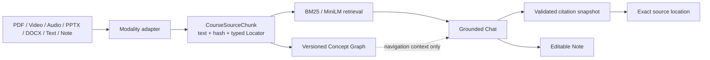

# Citefold

[](https://github.com/eatoften/Citefold/actions/workflows/ci.yml)

Citefold is a local-first learning workspace that turns course sources into
answers with citations you can reopen. The current MVP is deliberately narrow:

```text
PDF import -> persisted ingestion -> retrieval -> grounded answer
           -> exact page citation -> save Note -> restart and reopen
```

The supported entry point is the React browser app with a local FastAPI
backend. There is no supported desktop installer or hosted multi-user service.

## Why this is more than a chat wrapper

- Extracted, non-empty units from PDFs, video/audio transcripts, slides,
  documents, text, and published Notes converge on one `CourseSourceChunk`
  model with a typed `Locator`.
- The model may select only server-issued evidence IDs. The backend validates
  those IDs and stores immutable citation snapshots rather than trusting model
  prose as provenance.
- SQLite-backed tasks support idempotency, progress, cancellation, retry, and
  restart recovery.
- Retrieval experiments compare BM25, dense MiniLM, RRF, and graph expansion
  with frozen inputs and report both improvements and negative results.

## Run the MVP locally

### Requirements

- Python 3.11 and [uv](https://docs.astral.sh/uv/)
- Node.js 22 and npm
- [Ollama](https://ollama.com/) with `qwen3:4b` for live generated answers
- Internet access once to download the default MiniLM embedding model, or a
  complete local SentenceTransformer snapshot

FFmpeg is required only for video or audio ingestion, not for the PDF MVP.

### 1. Start the backend

```powershell
cd backend
uv sync --frozen
ollama pull qwen3:4b
$env:CITEFOLD_EMBEDDING_LOCAL_FILES_ONLY='false'
uv run --frozen python -B -m uvicorn app.main:app `
  --host 127.0.0.1 --port 8001 --reload
```

After the first embedding-model download, either omit that environment variable
and use the local cache or set `CITEFOLD_EMBEDDING_MODEL_PATH` to a verified
local snapshot.

### 2. Start the frontend

```powershell
cd frontend
npm.cmd ci
npm.cmd run dev
```

Open `http://127.0.0.1:5174`. The FastAPI schema is available at
`http://127.0.0.1:8001/docs`.

### 3. Exercise the golden journey

1. Create a course in **Sources** and import a text-based PDF (OCR is not
   currently enabled for scanned documents).
2. Wait for the persisted ingestion task to complete.
3. Open **Chat**, scope the conversation to the PDF, and ask a question whose
   answer is present in the document.
4. Open a sentence citation and verify that it returns to the exact PDF page.
5. Save the answer as a Note, restart both processes, and reopen the
   conversation, citation, and Note.

This is the release-critical path. Video, audio, PPTX, DOCX, Cards, FSRS, and
Concept Graph code remain available, but they do not expand the MVP promise.

## Current evidence

The public CS336 product slice uses the official Stanford CS336 Spring 2025
Lecture 3 slides, pinned to upstream commit
`b98b08a98d9d47a69bbdcb4e96a58aa48ee4d13b` and PDF SHA-256
`3692b3d25b5605e70930abc81d63241c71c136dfb573029d4544420925e0f9c4`.

| Check | Recorded result |
| --- | --- |
| Canonical ingestion | The production PDF adapter created 68 page Chunks with PDF-page Locators |
| Retrieval and citations | MiniLM returned the relevant page-65/page-66 Chunks; both citations reopened the exact quotations and pages |
| Persistence | The answer, citation snapshots, GraphVersion, result hash, route, and support basis survived reload |
| Deterministic graph path | `Full Attention -> Sparse Attention -> Sliding-window Attention`, two hops with evidence on each edge |

Only the final generation call in this recorded slice used a deterministic,
contract-compliant script. This evidence validates Source ingestion, retrieval,
persistence, citation, graph, and UI wiring. It does **not** establish live
Qwen answer quality, hallucination rate, graph accuracy, or held-out quality.
The three-Concept graph is an engineering fixture, not human gold.

Reproduce the isolated product workspace without committing the upstream PDF:

```powershell
cd backend
uv run --frozen python -m benchmark_acquisition.fetch `
  --manifest benchmark_acquisition/manifests/cs336-sp25-v1.json `
  --asset-id lecture-03-architecture
uv run --frozen python -m product_demo `
  --workspace data/product_demos/cs336-l3-attention-local
```

The frozen v1 evaluation receipt remains historically verifiable against its
recorded Git derivation commit. A later product-core cleanup changed the live
`uv.lock`, so that historical receipt is not presented as a current exact
replay environment; a new replay claim requires a newly derived protocol.

See the [public-course benchmark contract](docs/evaluation/public-course-benchmark.md)
and [engineering record](docs/productization-log.md) for the full claim boundary.

## Architecture


```mermaid
flowchart LR
    A["PDF / Video / Audio / PPTX / DOCX / Text / Note"]
    B["Modality adapter"]
    C["CourseSourceChunk<br/>text + hash + typed Locator"]
    D["BM25 / MiniLM retrieval"]
    E["Grounded Chat"]
    F["Validated citation snapshot"]
    G["Exact source location"]
    H["Editable Note"]
    I["Versioned Concept Graph"]

    A --> B --> C --> D --> E --> F --> G
    E --> H
    C --> I
    I -. "navigation context only" .-> E
```

SQLite is the local source of truth. Transactions, immutable revisions,
content hashes, compare-and-swap publication, and deterministic graph traversal
provide the current guarantees without adding distributed infrastructure before
measurements justify it.

## Technology

| Layer | Current choice |
| --- | --- |
| API and services | Python 3.11, FastAPI, Pydantic |
| Storage and search | SQLite, SQL migrations, FTS5/BM25 |
| ML and retrieval | PyTorch, SentenceTransformers/MiniLM, exact cosine, RRF |
| Generation | Ollama-compatible structured output with citation validation and refusal |
| Web | TypeScript, React, Vite |
| Verification | pytest, Vitest, ESLint, TypeScript build, GitHub Actions |

## Repository map

| Path | Responsibility |
| --- | --- |
| `backend/app/` | APIs, service/store boundaries, SQLite state, jobs, retrieval, citations, and Notes |
| `frontend/src/features/` | Sources, Chat, Notes, recovery, Studio, and Concept Graph interfaces |
| `backend/rag_lab/` | Offline retrieval and generation experiments; not a runtime dependency |
| `backend/golden_graph/` | Versioned public-course protocols and human-review tooling |
| `frontend/src-tauri/` | Manual desktop preview code; not a supported distribution path |
| `docs/decisions/` | Architecture decision records |
| `docs/modules/` | Module contracts and implementation notes |

## Verify a change

```powershell
cd backend
uv sync --frozen --group dev
uv run --frozen python -m compileall -q app tests
uv run --frozen pytest -q

cd ../frontend
npm.cmd ci
npm.cmd test
npm.cmd run lint
npm.cmd run build
```

CI also runs Rust formatting, compilation, and tests for the retained desktop
preview code. The manual desktop workflow builds an artifact for engineering
inspection only; it does not publish a release.

## Known limitations

- No durable browser E2E test or published 90-second demo yet.
- Scanned PDFs are not supported because OCR is not enabled.
- The default live Qwen model has not passed a frozen structured-output and
  answer-quality release gate.
- Retrieval numbers are development evidence over candidate annotations, not
  held-out or SOTA claims.
- The candidate graph is sparse and is useful for navigation experiments, not
  as factual authority.
- No cloud sync, authentication, collaboration, or public deployment.
- The repository still contains stable `VCC_*`, `.vcc-backup`, the legacy
  desktop bundle/data identifiers, and `video-course-cards-*` protocol
  identifiers to read older local data, preserve desktop-preview drafts, and
  verify immutable historical artifacts. New configuration uses
  `CITEFOLD_*`; those compatibility identifiers are not the product name.

## License

No open-source license has been declared. The repository is source-available
for review, but reuse and redistribution are not granted.
