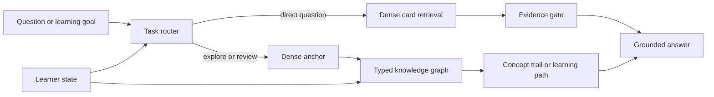

# Graph as an Associative Knowledge Structure

Last updated: 2026-07-21

## Status

This note states a research hypothesis, not a demonstrated large-scale result.
It separates three levels of evidence:

1. **Observed:** measurements on the current 118-card CS231n corpus.
2. **Inferred:** explanations consistent with those measurements.
3. **Hypothesized:** behavior expected only after the corpus and graph grow.

The compact audit artifact is
`docs/experiments/rag_graph_organization_audit_v1.json`.

## Thesis

Dense retrieval and a knowledge graph should not be forced to solve the same
problem.

```text
Dense retrieval
-> answer the question currently being asked
-> optimize direct relevance, evidence recall, and grounded answer quality

Knowledge graph
-> organize what is known across time
-> preserve typed relations, learning order, communities, and associative paths
-> support exploration, review, global sensemaking, and later personalization
```

The product hypothesis is therefore a dual system:



Graph traversal remains query- and task-conditioned. The present experiment
shows why unconditional graph expansion is not enough.

## Research Grounding

The phrase "human-like association" needs a careful definition. This project
does not claim that a card graph is a model of the brain. It borrows testable
computational ideas from cognitive and retrieval research:

- [Spreading activation](https://doi.org/10.1037/0033-295X.82.6.407) models
  concepts as linked nodes whose activation attenuates as it propagates.
- [Hippocampal indexing theory](https://pubmed.ncbi.nlm.nih.gov/3008780/)
  proposes that a partial cue can reactivate a distributed memory pattern
  through an index.
- [HippoRAG](https://papers.nips.cc/paper_files/paper/2024/hash/6ddc001d07ca4f319af96a3024f6dbd1-Abstract-Conference.html)
  turns this inspiration into a KG plus Personalized PageRank retrieval system.
- [GraphRAG](https://arxiv.org/abs/2404.16130) shows a different graph role:
  community structure and summaries improve global sensemaking questions over
  corpora near one million tokens.
- [KG2RAG](https://aclanthology.org/2025.naacl-long.449/) starts from dense
  anchors, then expands and organizes evidence through graph relations.
- [GNN-RAG](https://aclanthology.org/2025.findings-acl.856/) makes graph node
  importance query-dependent and retrieves paths for multi-hop KGQA.
- Educational work treats prerequisite edges as a separate structural signal
  for curriculum planning and tutoring, rather than mere semantic similarity
  ([Jia et al., NAACL 2021](https://aclanthology.org/2021.naacl-main.164/)).
- A knowledge-graph exploratory-search study with 54 participants motivates
  graph navigation for open-ended discovery rather than only known-item lookup
  ([Schneider et al., PACLIC 2023](https://aclanthology.org/2023.paclic-1.61/)).

Together these papers support a narrower claim: graphs are most plausible when
the task depends on relations, paths, communities, or accumulated experience.
They do not imply that adding graph neighbors improves every query.

## Operational Definition Of Association

For this project, an associative knowledge structure should eventually exhibit:

1. **Cue completion:** a partial or indirect concept retrieves useful connected
   concepts that flat top-k similarity misses.
2. **Relation sensitivity:** `prerequisite`, `contrast_with`, `example_of`, and
   `part_of` lead to different traversals.
3. **Controlled spreading:** activation decays by hop and stops when expected
   utility falls below cost.
4. **Global organization:** communities expose themes and gaps across lectures.
5. **Learning-state conditioning:** mastered, forgotten, or confusing concepts
   change which path is useful to a learner.
6. **Traceability:** every node and edge remains grounded in source cards,
   evidence spans, and timestamps.

The present graph only partially implements items 1, 2, and 6.

## Current Small-Data Audit

### Inputs

| Item | Value |
|---|---:|
| Lectures | 5 |
| Cards | 118 |
| Candidate accepted edges | 20 |
| Relation types | 5 |
| Embedding model | MiniLM, normalized 384-d |
| Random control | 5,000 matched samples |

The random control preserves the graph's composition of 16 same-lecture and 4
cross-lecture edges. This reduces the trivial explanation that graph edges look
similar only because most connect cards from the same lecture.

### Structural Results

| Measurement | Result |
|---|---:|
| Nodes covered by at least one edge | 32 / 118, 27.1% |
| Isolated cards | 86 |
| Nontrivial connected components | 12 |
| Largest connected component | 4 cards |
| Same-lecture edges | 16 |
| Cross-lecture edges | 4 |

This graph is too sparse and fragmented to test emergent large-scale knowledge
organization. Most cards cannot currently participate in an associative path.

### Relational Novelty Results

| Measurement | Result |
|---|---:|
| Candidate-edge mean cosine | 0.515 |
| Lecture-matched random non-edge mean | 0.267 |
| Random 95% interval | [0.209, 0.330] |
| Candidate minus random mean | +0.248 |
| Directed edge endpoints outside Dense top-5 | 15 / 40, 37.5% |
| Edges with at least one endpoint outside Dense top-5 | 9 / 20, 45.0% |
| Median endpoint Dense-neighbor rank | 4 |

The Monte Carlo probability of a matched random sample reaching the observed
mean was `1/5001`. This is a descriptive randomization result, not a formal
population p-value: the candidate edges were model-assisted and selectively
constructed.

The graph mostly connects semantically coherent concepts, while 45% of edges
contain at least one direction that is not already a Dense top-5 neighbor. That
is the small-data signal for structural information beyond pure similarity.

Examples:

| Typed relation | Dense ranks in two directions | Interpretation |
|---|---:|---|
| Image Pixel Representation `prerequisite` Image Classification Core Task | 13 / 59 | Learning order is meaningful despite weak reverse semantic proximity. |
| Gradient Propagation for Basic Operations `part_of` Computational Graphs | 32 / 33 | Cross-lecture structural link not exposed by local Dense neighbors. |
| Momentum Update Mechanism `contrast_with` RMSProp Mechanism | 13 / 6 | A comparison edge can support deliberate review even when one direction is nonlocal. |
| Scalar Derivative `contrast_with` Vector to Scalar Derivative | 1 / 1 | Graph adds a relation label but no discovery beyond Dense. |

### Direct-QA Result

The existing RAG development experiment provides the other half of the story:

| System | nDCG@5 | Multi-hop joint Recall@3 |
|---|---:|---:|
| Dense | **0.924** | 0.750 |
| Dense + candidate graph | 0.852 | **0.875** |

Graph expansion improves one multi-hop coverage slice but harms ordinary
ranking. At answer time it produces one citation-recall win, 39 ties, and no
multi-hop generation gain. The current evidence therefore supports Dense for
direct QA and leaves Graph as an unproven but measurable organization layer.

## Scale Hypotheses

### H1: Task-Conditional Crossover

As the corpus grows, Graph will not uniformly surpass Dense. Its relative value
will increase specifically for multi-hop, global-theme, exploratory, and
learning-path tasks, producing a `task type x corpus scale` interaction.

### H2: Relational Novelty

A human-verified typed graph will retrieve useful nonlocal concepts that are
absent from the Dense neighborhood while satisfying a minimum relevance floor.
The expected gain is in discovery and path quality, not necessarily factoid
MRR.

### H3: Dual-System Superiority

A router that selects Dense for direct questions and Graph for structural tasks
will outperform both `always Dense` and `always expand Graph` under the same
token and latency budgets.

### H4: Personalized Spreading Activation

Conditioning graph activation on review history and mastery will improve
learning-path utility, delayed recall, or time-to-mastery compared with a static
course graph.

### H5: Graph Quality Threshold

Scale alone is insufficient. Graph benefit will appear only after edge
precision, node coverage, and typed-direction quality cross a measurable
threshold. Below that threshold, added nodes remain distractors.

## Scaling Protocol

Freeze incremental course snapshots, for example `100`, `250`, `500`, `1,000`,
and `5,000+` cards. For every snapshot compare:

1. Dense only.
2. Dense plus unconditional untyped expansion.
3. Dense anchor plus typed one-hop traversal.
4. Dense anchor plus query-conditioned PPR or path search.
5. A task router choosing direct retrieval, graph traversal, or abstention.

Use the same answer model, context budget, top-k budget, and test questions.
Stratify results by direct factual, comparison, multi-hop, global-theme,
exploratory, and prerequisite-order tasks.

### Metrics

Direct QA:

- Recall, MRR, nDCG, answer correctness, citation precision, abstention F1.

Associative structure:

- Human edge precision by relation type.
- Nonlocal useful discovery@k.
- Path precision and path recall.
- Relevance-constrained concept diversity.
- Community purity and stability across snapshots.
- Graph coverage, isolate rate, and degree bias.

Learning value:

- Prerequisite violations in recommended paths.
- Time or clicks to reach a target concept.
- Concept coverage under a fixed review budget.
- Immediate and delayed quiz gain.
- Learner-rated usefulness and unexpected-but-relevant discovery.

Systems cost:

- Retrieval latency, tokens, memory, edge-construction cost, and update cost.

## Falsification Conditions

The associative-graph hypothesis should be weakened or rejected if, after
independent edge annotation and greater scale:

1. Useful graph neighbors remain almost entirely inside Dense top-k.
2. Typed traversal does not improve path or exploratory metrics.
3. Graph gains disappear under equal token and latency budgets.
4. Users do not learn or navigate more effectively with graph-supported paths.
5. Edge noise and maintenance cost grow faster than useful coverage.
6. A flat diversity-aware Dense retriever matches every graph benefit.

## Research Positioning

A defensible project statement is:

> On a 118-card course corpus, dense retrieval was the stronger direct-QA
> baseline. A separate structural audit found that 45% of candidate graph edges
> exposed at least one association outside the Dense top-5, but the graph covered
> only 27% of cards. This motivates a falsifiable scale study of whether typed,
> query-conditioned graph activation improves exploratory learning and global
> knowledge organization without harming direct question answering.

The important contribution is not claiming that Graph is already more human.
It is identifying where graph structure carries information that embeddings do
not, defining the tasks where that information should matter, and designing the
experiment that can prove the idea wrong.
